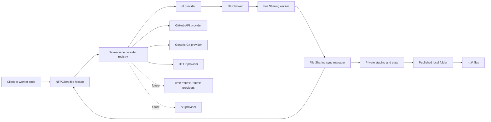

# ADR - Extensible Data Sources, GitHub API, and Git Synchronization

## Status

Proposed.

## Date

2026-08-27.

## Decision Summary

Extend file retrieval through a small provider registry used by `NFPClient`.
Keep `NFPClient.fetch_file()` as the public compatibility facade, preserve the
existing `nf://` behavior, and dispatch other enabled URI schemes to providers
that run in the client's process.

Add tree-level pull and push operations to the same facade. The File Sharing
worker will use these operations to synchronize configured data sources into
clean local publication folders. Files published there remain available to all
workers through the existing `nf://` service.

GitHub and generic Git are the first bidirectional tree providers. The GitHub
provider integrates directly with the versioned GitHub REST API for repository
metadata, references, trees, blobs, commits, and branch updates. A separate Git
provider supports GitHub-compatible and non-GitHub Git remotes through normal
Git transports. The provider model must allow later HTTP, FTP, TFTP, SFTP/SCP,
S3, and other implementations without adding scheme branches to the client or
worker.

External data-source access is opt-in. Arbitrary external URLs supplied to
remotely callable worker tasks must not become an unrestricted SSRF or
credential-exfiltration path. File Sharing synchronization therefore uses
named data sources, and direct client/worker retrieval is constrained by
configured schemes and hosts.

## Context

The current implementation has two tightly connected pieces:

- `NFPClient.fetch_file()` accepts only `nf://`, calls
  `filesharing.file_details`, streams bytes from `filesharing.fetch_file`, and
  caches the result below the client's `fetchedfiles` directory.
- `NFPWorker.is_url()` recognizes only `nf://`, while
  `NFPWorker.fetch_file()` delegates to its embedded `NFPClient`.

The File Sharing worker maps `nf://` paths to `base_dir`, validates lexical
containment, and provides list, walk, details, and streaming tasks. NFAPI adds
one built-in File Sharing worker whose `base_dir` is the NorFab inventory base
directory.

This is a useful distribution mechanism but it assumes that every shared file
already exists below one File Sharing worker's `base_dir`. Users also need to:

- fetch an individual file directly from an external Data Source;
- pull a Git repository or subdirectory into a local shared folder;
- publish local changes back to a GitHub repository;
- keep a local shared folder synchronized with a branch;
- add other data-source types without repeatedly changing `NFPClient`,
  `NFPWorker`, and the File Sharing worker.

Adding a list of `if url.startswith(...)` branches to the existing client would
meet the first use case but would couple protocol parsing, authentication,
transfer behavior, caching, and synchronization policy to the NFP transport
client. It would also incorrectly treat byte-oriented protocols and
revisioned tree stores as equivalent.

## Goals

- Preserve all existing `nf://` URLs and return behavior.
- Let all workers fetch from explicitly enabled data-source schemes through their
  existing `self.fetch_file()` helper.
- Let normal Python clients fetch Data Source files directly without routing the
  bytes through the broker.
- Let File Sharing pull source content into a local folder and expose it as
  `nf://...`.
- Let File Sharing push local folder content to GitHub and safely reconcile
  bidirectional changes.
- Make first-class GitHub API and generic Git support the first implementations
  of a general data-source provider contract.
- Keep broker, NFP message framing, and existing File Sharing streaming tasks
  unchanged.
- Avoid a mandatory GitHub SDK, Git, S3, or SSH dependency in NorFab core.
- Define safe failure, authentication, conflict, and publication behavior.

## Non-Goals

- Do not turn NFP into a general data-source filesystem protocol.
- Do not proxy every external Data Source download through the File Sharing worker.
- Do not add NFP client-to-worker file upload streaming in the first phase.
- Do not implement Git merges, rebases, force pushes, or automatic conflict
  resolution.
- Do not add GitHub pull request, issue, release, webhook management, or
  repository administration APIs in the first phase. Repository contents and
  Git database APIs are in scope.
- Do not promise identical semantics across Git, HTTP, TFTP, and object stores.
  Providers advertise capabilities instead.
- Do not support multiple File Sharing worker processes writing the same local
  publication folder. A Data Source has one writer.

## Decision

### 1. Separate the facade, provider contract, and synchronization policy

Use three layers:



The responsibilities are:

- `NFPClient` provides stable methods, selects a provider, applies common local
  destination and error handling, and preserves the current result shape.
- A data-source provider owns URI parsing and external protocol behavior.
- The File Sharing sync manager owns configured Data Sources, scheduling, locks,
  manifests, conflict policy, staging, and publication.

No data-source provider should know about File Sharing task models or the NFP
wire protocol. No File Sharing task should contain Git subprocess logic.

### 2. Adopt Data Source and Data File concepts

Borrow NetBox's separation between a configured Data Source and the Data Files
materialized from it. These are NorFab concepts and state records, not NetBox
model dependencies.

A NorFab Data Source contains:

- `name`: stable identifier used in `github://<name>/...` and
  `git://<name>/...` URLs;
- `type`: provider name such as `github`, `git`, or later `s3`;
- `url` and provider-specific configuration;
- `enabled`: whether manual or scheduled synchronization is permitted;
- `status`: maintained by synchronization, not manually configured;
- `ignore_rules`: `fnmatch`-style relative-path and basename patterns;
- `sync_interval`: optional automatic synchronization interval, with no value
  meaning manual synchronization only;
- `last_synced`: time of the last successful source synchronization;
- NorFab extensions for `direction`, `source_revision`, conflict policy,
  publication behavior, and sanitized last error.

A NorFab Data File record belongs to one Data Source and contains:

- source-relative `path`;
- `size_bytes`;
- `sha256` content hash;
- `last_updated`, changed only when file content changes;
- source revision and publication generation.

The initial implementation persists these records as the data source's atomic
manifest below `__norfab__`; it does not require a new central database. SHA256
is used for new Data File manifests even though the existing `nf://`
file-details compatibility contract currently reports MD5.

Synchronization and publication are distinct stages. A source sync builds a
validated private snapshot and its Data File manifest. `auto_publish: true`
atomically publishes that snapshot immediately. With `auto_publish: false`,
status becomes `pending_publication` until an explicit publication task applies
the snapshot. This borrows the safety of NetBox's two-stage synchronized-data
flow so external changes need not affect active automation immediately.

NorFab intentionally extends NetBox's consumption-oriented model:

- `pull` sources replicate external data locally; local drift is reported and
  is replaced by the next published source generation;
- `push` sources publish the local tree upstream;
- `bidirectional` sources use revision and manifest conflict detection before
  selecting pull or push.

Use the following source statuses initially: `never_synced`, `syncing`,
`pending_publication`, `current`, `failed`, `conflicted`, and `disabled`.

Public configuration keys, Python methods, File Sharing tasks, result fields,
state paths, logs, and documentation use `data_source` or `data_sources`.
Reserve "remote" for an actual protocol endpoint or the established Git term
"Git remote"; it is not the NorFab domain-object name.

### 3. Add a capability-based data-source provider registry

Add a small module such as `norfab/core/file_transfer.py` containing request
and result data classes, provider errors, capability names, and a registry.
Providers are selected with `urllib.parse.urlsplit(url).scheme`; prefix tests
must not be used.

The conceptual provider contract is:

```python
class DataSourceProvider(Protocol):
    name: str
    schemes: frozenset[str]
    capabilities: frozenset[str]

    def fetch_file(self, request: FetchRequest) -> TransferResult: ...
    def push_file(self, request: PushRequest) -> TransferResult: ...
    def pull_tree(self, request: PullTreeRequest) -> TransferResult: ...
    def push_tree(self, request: PushTreeRequest) -> TransferResult: ...
    def get_revision(self, request: RevisionRequest) -> RevisionResult: ...
```

The concrete implementation may use an abstract base class instead of a
typing protocol. An operation not present in `capabilities` fails with a clear
`UnsupportedOperation` error. This matters because, for example:

| Provider | Fetch file | Push file | Pull tree | Push tree | Stable revision |
| --- | --- | --- | --- | --- | --- |
| `nf` | yes | later | no | no | MD5 only |
| GitHub API | yes | yes | yes | yes | commit SHA |
| Generic Git | yes | no | yes | yes | commit ID |
| HTTP/HTTPS | yes | optional PUT | no | no | ETag when present |
| FTP/SFTP | yes | yes | adapter-dependent | adapter-dependent | usually no |
| TFTP | yes | yes | no | no | no |
| S3 | yes | yes | prefix pull | prefix push | version ID/ETag |

Built-in providers are registered directly. Third-party providers use a new
Python entry-point group, for example:

```toml
[project.entry-points."norfab.data_source_providers"]
my_source = "my_package.provider:MyDataSourceProvider"
```

Entry points are loaded lazily when their scheme is first requested. A broken
optional provider must not prevent the client from starting or affect
`nf://`.

The registry rejects duplicate schemes unless inventory explicitly selects a
provider. This avoids installation order changing URL behavior.

### 4. Keep `NFPClient` as a thin compatibility facade

Retain the existing method and add an optional destination:

```python
client.fetch_file(
    url,
    destination=None,
    chunk_size=256000,
    pipeline=10,
    timeout=600,
    read=False,
    provider_options=None,
)
```

Dispatch behavior is:

- `nf://` calls the current NFP streaming implementation, extracted into a
  private helper with no protocol changes.
- Other schemes call their local provider. Bytes travel directly between the
  external source and the client or worker process.
- `destination=None` keeps the exact current cache path for `nf://`. Other
  providers use a collision-safe cache path containing the scheme, a digest of
  the normalized credential-free source, and the safe basename.
- `destination` is intended for trusted local Python callers and for File
  Sharing's private staging path. It is not accepted verbatim from a task
  request.
- `read=True` retains current UTF-8 text behavior. Binary callers use
  `read=False`.

Keep the current result keys during migration:

```python
{
    "status": "200",
    "content": "<path or text>",
    "error": None,
    "metadata": {
        "provider": "git",
        "revision": "<commit-id>",
        "cached": False,
    },
}
```

`metadata` is additive. Existing callers that read `status`, `content`, and
`error` continue to work.

Add facade methods for tree operations rather than overloading
`fetch_file()`:

```python
client.pull_tree(url, destination, provider_options=None)
client.push_tree(source, url, provider_options=None)
client.push_file(source, url, provider_options=None)
client.supports_url(url, capability="fetch_file")
```

`NFPWorker.is_url()` delegates to `self.client.supports_url()`, and
`NFPWorker.fetch_file()` otherwise remains unchanged. This is the only
required generic worker change.

The facade does not imply that all schemes are enabled. The default remains
`nf` only, preserving the current security boundary and dependency footprint.

### 5. Define unambiguous GitHub and Git URLs

GitHub and Git identify repositories, while NorFab consumers often need one
file or a subdirectory at a revision. Do not infer a repository boundary from
arbitrary path segments.

Support these forms:

```text
github://<source>/<path>?ref=<branch-tag-or-commit>
git://<source>/<path>?ref=<branch-tag-or-commit>
git+https://<host>/<owner>/<repo>.git?ref=main&path=<path>
git+ssh://git@github.com/<owner>/<repo>.git?ref=main&path=<path>
```

`github://<source>/...` is the recommended GitHub form. The Data Source contains
the GitHub API base URL, repository owner/name, authentication reference, and
default ref. This supports both GitHub.com and GitHub Enterprise Server without
putting API tokens or repository administration details into job arguments.

`git://<source>/...` is the recommended NorFab logical form. The authority is
a named, locally configured Data Source; it is not the unauthenticated
native Git wire protocol. This keeps credentials and repository URLs out of
task arguments and logs.

`git+https` and `git+ssh` are explicit direct forms for trusted local callers.
They remain disabled until allowed by inventory policy. Query fields are
parsed as structured data, removed before invoking Git, and never interpolated
into a shell command. A direct form is an ephemeral Data Source request: it is
not persisted, scheduled, or accepted by remotely callable File Sharing tasks.

`ref` defaults only when the Data Source declares a default branch. A caller
must not silently fall back from an unknown ref to the source default. For a
reproducible fetch, use a full commit ID.

### 6. Implement first-class GitHub API and generic Git providers

#### GitHub API provider

The first iteration includes a dedicated provider for the versioned GitHub REST
API. It does not shell out to Git for normal GitHub operations.

Pull uses GitHub repository and Git database endpoints to:

1. Resolve the configured branch, tag, or commit to an immutable commit SHA.
2. Read the commit and root tree.
3. Traverse the configured `source_path`, handling a truncated recursive-tree
   response by walking subtrees rather than accepting incomplete content.
4. Fetch blobs, validate their declared sizes and modes, and materialize the
   clean staging tree.

Push uses the Git database endpoints to:

1. Read the current branch reference and compare it with the expected SHA.
2. Create blobs for added or changed files.
3. Create a tree based on the current source tree, including explicit deletion
   entries for removed files.
4. Create a commit whose parent is the expected source commit.
5. Update the branch reference with `force=false`.

The final reference update is the optimistic concurrency boundary. If the
branch moved after the initial read, or GitHub rejects the update because of
branch rules, the operation fails without force and the synchronization state
is not advanced.

The provider must send an explicit supported `X-GitHub-Api-Version`, GitHub's
JSON media type, a stable `User-Agent`, and bounded request timeouts. The API
version is a tested provider default with an optional Data Source override; it is
not silently changed at runtime.

Use a small HTTP client rather than a GitHub SDK. GitHub App JWT signing should
use a maintained cryptographic/JWT library supplied through an optional
`githubdatasource` installation extra; do not hand-roll RSA signing. The provider
is loaded lazily, so this optional dependency does not enlarge NorFab core or
affect `nf://` users.

GitHub App installation authentication is the recommended automation mode.
The provider creates and refreshes short-lived installation access tokens from
an App ID, installation ID, and private-key reference. A fine-grained personal
access token referenced through an environment variable is supported for
simpler deployments. Data Sources declare required repository `Contents` access:
read for pulls and write for pushes. Tokens are never accepted in a URL.

The provider records rate-limit headers in sanitized status metadata, uses
conditional requests where useful, honors `Retry-After` and rate-limit reset
times, and never retries mutating requests blindly. It uploads only changed
blobs and enforces a configured changed-file ceiling per push; large bulk
repositories can select the generic Git provider instead. GitHub Enterprise
Server is supported through an explicit HTTPS API base URL and the same host
policy.

#### Generic Git provider

The generic Git provider is also included in the first iteration. It supports
GitHub repositories when users explicitly choose Git transport, as well as
GitLab, Bitbucket, self-hosted servers, and filesystem remotes supported by the
local Git installation.

It uses the installed Git executable through `subprocess.run()` with an
argument list, `shell=False`, bounded timeouts, and captured/redacted output.
If Git is unavailable, provider discovery still succeeds but status reports
the missing executable and Git operations fail clearly. A future pure-Python
provider can claim the same capabilities without changing callers.

Generic Git authentication options are references, not secret values:

- HTTPS token through a named environment variable and a non-interactive
  ask-pass helper;
- SSH key path, known-hosts path, and strict host-key checking;
- ambient credential helper only when explicitly enabled.

Never place a GitHub or Git token in a URL, command argument, result, persistent
state file, or log. Never disable SSH host-key validation by default. File
Sharing's `get_inventory` result must redact literal credential fields if
legacy configuration permits them at all.

Neither first-iteration provider initializes submodules or Git LFS. Both can
contact additional endpoints and must be separate opt-in capabilities with the
same host policy.

### 7. Configure named Data Sources and File Sharing publication

Put Data Source connection definitions and direct-fetch policy in the existing
top-level `client` inventory section. Every normal client and every worker's
embedded client already receives this configuration object:

```yaml
client:
  data_source_policy:
    allowed_schemes: [github, git, git+https, git+ssh]
    allowed_hosts: [api.github.com, github.com, git.example.com]
    max_file_bytes: 104857600
    max_tree_bytes: 1073741824
    max_tree_files: 10000
    max_changed_files_per_push: 500

  data_sources:
    github-configs:
      type: github
      url: "https://github.com/example/network-configs"
      api_url: "https://api.github.com"
      repository: "example/network-configs"
      ref: main
      enabled: true
      sync_interval: 300
      ignore_rules:
        - ".git*"
        - "private/*"
      auth:
        type: github_app
        app_id_env: GITHUB_APP_ID
        installation_id_env: GITHUB_INSTALLATION_ID
        private_key_file_env: GITHUB_PRIVATE_KEY_FILE

    vendor-git:
      type: git
      url: "git+ssh://git@git.example.com/network/templates.git"
      ref: main
      enabled: true
      sync_interval: 300
      auth:
        ssh_key_file_env: GIT_SSH_KEY_FILE
        known_hosts_file_env: GIT_KNOWN_HOSTS_FILE
```

File Sharing inventory then maps those client Data Sources into published folders
and adds synchronization policy:

```yaml
service: filesharing
base_dir: "./"

data_sources:
  github-configs:
    source_path: "norfab"
    local_path: "shared/configs"
    direction: bidirectional
    conflict_policy: fail
    auto_publish: false
    commit:
      author_name: "NorFab File Sharing"
      author_email: "norfab@example.invalid"

  vendor-git:
    source_path: "templates"
    local_path: "shared/vendor-templates"
    direction: pull
    auto_publish: true
```

Rules for Data Sources:

- `client.data_sources` is loaded once by `NFPClient`; a source name resolves
  `github://<source>/...` or `git://<source>/...` locally without exposing its
  endpoint or authentication details to the job argument.
- A File Sharing `data_sources` entry has the same name as one configured
  `client.data_sources` entry and extends it with publication and
  synchronization settings. The sync manager passes that source plus its
  private staging destination to `self.client.pull_tree()` or
  `self.client.push_tree()`.
- `local_path` is relative to `base_dir`, cannot overlap another managed
  Data Source, and cannot resolve through a symlink outside `base_dir`.
- `source_path` is relative to the repository root.
- `direction` is `pull`, `push`, or `bidirectional`.
- `conflict_policy` is only `fail` in the first implementation.
- `sync_interval: 0` disables background synchronization. Explicit tasks
  remain available.
- Data Sources are validated during File Sharing worker initialization. Invalid
  sources do not become partially active.
- A remotely callable task accepts a Data Source name, not an arbitrary source URL
  or local destination.

The default `client` configuration has no enabled external schemes or Data Sources,
and the built-in File Sharing inventory continues to contain only `service`
and `base_dir`; external data-source access is not enabled accidentally.

### 8. Add File Sharing Data Source tasks

Add typed tasks with consistent result metadata:

- `data_source_list()` lists configured Data Sources and provider capabilities
  without returning credentials.
- `data_source_status(name)` returns enabled state, synchronization status,
  direction, source revision, local publication generation, last attempt,
  `last_synced`, next scheduled attempt, and the last sanitized error. For
  GitHub it also returns sanitized API version and rate-limit remaining/reset
  metadata from the most recent response.
- `data_source_files(name, path=None)` lists Data File metadata without reading
  entire file contents into the task result.
- `data_source_pull(name, dry_run=False, publish=None)` retrieves source content
  into a validated snapshot. `publish` overrides `auto_publish` for that call.
- `data_source_publish(name, generation=None, dry_run=False)` atomically makes
  a synchronized snapshot available below `local_path` and therefore through
  `nf://`.
- `data_source_push(name, message=None, dry_run=False)` publishes local changes
  to the external source.
- `data_source_sync(name, dry_run=False)` applies the configured direction,
  conflict, and publication rules.

Tasks should report the resolved Git commit or equivalent source revision,
whether local or source content changed, file counts, byte counts, and elapsed
time. Events and logs must not contain credentials or credential-bearing URLs.

The worker implements these tasks by calling its existing embedded client,
using `self.client.pull_tree()` and `self.client.push_tree()` with private
staging paths. This keeps the File Sharing service on the same provider facade
as every other worker and avoids a second provider-loading implementation.

Task calls that mutate an external source are explicitly marked destructive in
MCP task annotations. Pull without publication changes only private managed
state. Publication is locally destructive when it replaces published content
and must not be marked read-only.

### 9. Keep provider state private and publish clean trees

Do not clone a repository directly into a folder served by `nf://`. A direct
clone would expose or traverse `.git` content, mix partial updates with reads,
and make rollback difficult.

Use two roots:

```text
<inventory-base>/__norfab__/files/data_sources/<worker>/<source>/
  provider/         # API object cache or private Git metadata/worktree
  staging/          # next clean publication
  state.json        # revision and manifest, no secrets

<filesharing-base>/<local_path>/
  ...               # clean published data available via nf://
```

Pull synchronization and optional publication follow this sequence:

1. Acquire the Data Source lock and set status to `syncing`.
2. Fetch GitHub API objects or clone/fetch Git into private provider state.
3. Resolve the requested ref to an immutable commit ID.
4. Export only `source_path` into a fresh staging directory.
5. Reject forbidden file types, unsafe symlinks, path escapes, and configured
   count or size limit violations.
6. Build the Data File manifest, preserve `last_updated` for unchanged SHA256
   entries, and compare it with both the previous synchronized manifest and
   the last published manifest.
7. Persist the new source revision, Data File manifest, and snapshot generation
   atomically.
8. If publication is enabled, replace the publication directory using
   same-filesystem renames, retaining a temporary backup until the new tree is
   in place and set status to `current`. Otherwise set status to
   `pending_publication`.

Readers therefore see the old complete tree or the new complete tree, not a
partially copied tree. If replacement fails, restore the previous publication
and report failure.

The implementation must account for Windows rename behavior, open handles,
read-only Git files, and antivirus races. Retry only bounded transient rename
failures and preserve a recoverable backup when rollback cannot complete.

### 10. Use conservative Git push and bidirectional rules

For push, the synchronization manager uses the selected provider's tree
operations:

1. Lock the Data Source and snapshot the clean published folder.
2. Fetch the source ref.
3. Compare the source revision, last synchronized revision, and local
   manifest.
4. Materialize the snapshot as GitHub blobs/tree objects or in the private Git
   worktree.
5. Create a commit only when there is a content change.
6. Update the GitHub ref with `force=false` or push Git normally; never force
   push.
7. Persist the accepted source commit and local manifest.

For `bidirectional`, track both the immutable source revision and local content
manifest from the last successful synchronization:

| Source changed | Local changed | Action |
| --- | --- | --- |
| no | no | no-op |
| yes | no | pull; publish according to `auto_publish` |
| no | yes | commit and push |
| yes | yes | fail with conflict details |

The first implementation deliberately fails even when Git could automatically
merge both changes. An operator resolves the conflict in Git or locally and
retries. This avoids an automation service silently choosing content.

Source deletion is propagated on pull. Local deletion is included in a push.
`dry_run` reports these changes without modifying either side.

GitHub branch protection/rulesets, required reviews, and server-side hooks
remain authoritative; a rejected GitHub reference update or Git push is a
normal failed result and does not trigger a force push or API bypass.

### 11. Use one lightweight File Sharing synchronization loop

File Sharing may start one daemon synchronization loop when at least one Data
Source has `sync_interval > 0`. The loop:

- uses the worker exit event;
- wakes for the next due Data Source rather than polling continuously;
- calls the same sync-manager methods as explicit tasks;
- has a per-source lock so scheduled and manual runs cannot overlap;
- applies bounded operation timeouts;
- records failure and schedules the next normal interval without a tight retry
  loop.

Do not put external data-source operations in `WorkerWatchDog.watchdog_tasks`.
Watchdog callbacks run inline with worker health checks, and a slow Git or S3
operation should not delay those checks.

The first implementation may deliver explicit tasks before enabling the loop,
but the state, locking, and task contracts must be shared so scheduling does
not require an architectural change.

### 12. Harden local path handling before publishing data-source content

The current File Sharing path check uses `abspath` and `commonpath`. That blocks
lexical `..` traversal but does not by itself prevent an existing symlink below
`base_dir` from resolving outside it.

Before publication from any external Data Source is enabled:

- resolve the base and candidate with `realpath`/`Path.resolve()` and verify
  containment;
- define and test Windows drive, UNC, separator, and case-normalization cases;
- do not follow directory symlinks in `walk()`;
- exclude provider state, `.git`, temporary, backup, and internal
  `__norfab__` directories explicitly;
- reject special files such as devices, sockets, and named pipes;
- reject symlinks in externally sourced trees in the first implementation;
- apply the same rules after URI percent-decoding.

This hardening is required even though provider-private state sits outside the
published directory, because an external repository can contain malicious paths
or symlinks.

### 13. Make external data-source access policy explicit

Expanding `NFPWorker.is_url()` can turn existing remotely callable tasks into
external Data Source fetchers. Therefore:

- only `nf` is enabled by default;
- every additional direct scheme is opt-in per process inventory;
- host allowlists are checked after DNS resolution and again on redirects;
- loopback, link-local, and private destinations are denied by default for
  HTTP-like providers unless explicitly allowed;
- redirects cannot change to a disallowed scheme or host;
- providers use connection, read, and total timeouts plus byte limits;
- the GitHub provider accepts only configured HTTPS API base URLs, pins an API
  version, validates response content types, and applies rate-limit responses;
- HTTP(S) user-info and all password-bearing user-info are rejected so
  credentials cannot arrive in task arguments; `git+ssh` may contain a
  username such as `git` but never a password;
- errors and metadata use sanitized source identifiers;
- File Sharing Data Source tasks use preconfigured source names only.

TFTP and native unencrypted FTP or Git transports must be disabled by default
and documented as insecure when an adapter is added. Prefer HTTPS, SSH/SFTP,
and authenticated object-store APIs.

## Minimal Code Change Boundary

The first implementation should be limited to:

1. Add provider contracts and registry in one core module.
2. Extract the existing `nf://` body of `NFPClient.fetch_file()` into the
   built-in NF provider or a private NF adapter, add `destination`, and add the
   small tree facade methods.
3. Change `NFPWorker.is_url()` to consult client capabilities. Keep
   `NFPWorker.fetch_file()` call sites intact.
4. Add one GitHub REST API provider module and one generic Git provider module.
5. Add File Sharing Data Source models and one synchronization manager module.
6. Add the seven File Sharing Data Source tasks and, after task behavior is stable,
   the optional synchronization loop.
7. Harden File Sharing path resolution and walking.
8. Add one entry-point group for external providers. Use a small HTTP client
   rather than a GitHub-specific SDK, and place the maintained JWT/cryptographic
   dependency needed for GitHub App authentication in an optional
   `githubdatasource` installation extra.

No change is required in the broker, NFP constants, message builder, worker
job database, or existing stream/PUT flow.

## Implementation Sequence

### Phase 1 - Provider boundary and compatibility

- Add provider contracts, registry, normalized results, and policy checks.
- Wrap the current NF transfer code without changing behavior.
- Add `destination` and collision-safe paths for non-NF sources.
- Delegate worker URL recognition to the client.
- Add unit tests using a fake provider loaded directly and through an entry
  point.

### Phase 2 - GitHub API and generic Git pull

- Add GitHub and Git Data Source parsing and authentication references.
- Implement the GitHub API client with explicit versioning, GitHub App token
  refresh, fine-grained PAT support, rate-limit handling, ref/tree/blob reads,
  and GitHub Enterprise API base URLs.
- Implement generic Git immutable-ref resolution and private clone/fetch.
- Implement shared clean export, validation, manifest generation, and atomic
  publication for both providers.
- Add `data_source_list`, `data_source_status`, `data_source_files`,
  `data_source_pull`, and `data_source_publish`.
- Verify that published files are immediately retrievable with their expected
  `nf://` paths.

### Phase 3 - GitHub API and generic Git push

- Add GitHub blob/tree/commit creation and non-force reference updates.
- Add generic Git snapshot, commit, non-force push, expected-revision checks,
  and dry run.
- Add `data_source_push` and `data_source_sync`.
- Implement the fail-on-both-changed conflict matrix.
- Test rejected GitHub reference updates, rejected Git pushes, and recovery
  without losing the local publication.

### Phase 4 - Continuous synchronization and additional providers

- Add the optional File Sharing synchronization loop.
- Implement HTTP/HTTPS file fetch as an additional provider to prove that the
  contract is not Git-specific.
- Add FTP, TFTP, SFTP/SCP, and S3 only as separately tested providers with
  capability-appropriate semantics and optional dependencies.

## Testing and Validation

### Compatibility tests

- All current File Sharing and `nf://` tests pass unchanged.
- Existing Nornir, workflow, agent, and Containerlab URL call sites continue to
  work.
- Unknown or disabled schemes return a deterministic unsupported-scheme error.
- The legacy result keys and default NF cache location remain unchanged.

### Provider tests

- Registry selection uses the parsed scheme and detects duplicate providers.
- Optional-provider import failure does not break client startup.
- Capability checks reject unsupported push or tree operations before doing
  local or external source work.
- Destination traversal, URL user-info, unsafe redirects, and sanitized errors
  are covered.

### GitHub API tests

- Use a fake HTTP transport for deterministic ref, commit, tree, blob,
  authentication, pagination/truncation, API-version, and rate-limit tests.
- Test GitHub App installation token refresh and fine-grained PAT header
  construction without placing token values in recorded requests or output.
- Test the complete write sequence: compare ref, create blobs, create tree,
  create commit, and update ref with `force=false`.
- Test a reference race, branch-rule rejection, API timeout, malformed response,
  exhausted rate limit, and GitHub Enterprise API base URL.
- Keep one credential-gated GitHub repository integration test in CI for API
  contract validation; it may be skipped when credentials are unavailable.

### Generic Git tests

- Use local bare repositories for clone, pull, push, deletion, tag, branch, and
  pinned-commit tests.
- Test a source-only change, local-only change, both-sides conflict, no-op,
  non-fast-forward rejection, and branch-protection-like rejection.
- Test credentials never appear in command arguments, logs, state, events, or
  results.
- Test missing Git executable and operation timeout behavior.
- Run filesystem cases on Windows and POSIX.

### File Sharing tests

- Pulled content is visible at the configured `nf://` path only after complete
  publication.
- A source with `auto_publish: false` reaches `pending_publication` without
  changing the live `nf://` tree; `data_source_publish` then promotes the
  selected generation and changes status to `current`.
- Data File records contain source-relative path, size, SHA256, source revision,
  and `last_updated`; an unchanged resynchronization does not change
  `last_updated`.
- Disabled Data Sources cannot be synchronized manually or by the scheduler,
  and absent/zero `sync_interval` sources remain manual-only.
- Ignore rules match both source-relative paths and bare filenames.
- Concurrent manual and scheduled sync attempts for one Data Source do not
  overlap.
- Failed export or rename preserves or restores the last good publication.
- Overlapping Data Source paths, symlinks, special files, `.git`, internal folders,
  file-count limits, and byte limits are rejected.
- `data_source_status` survives worker restart and contains no secrets.

The default local suite must not require GitHub access. The credential-gated
GitHub integration test verifies the first-class integration in an integration
CI job and is not replaced by generic Git tests.

## Alternatives Considered

### Implement every scheme directly in `NFPClient.fetch_file()`

Rejected because the client would accumulate protocol dependencies and
scheme-specific policy. Tree synchronization and revision conflicts also do
not fit a single-file method.

### Route every Data Source through File Sharing

Rejected as the only mode because workers and local clients sometimes need a
direct, short-lived fetch and should not incur broker streaming or require a
shared cache. File Sharing remains the correct mode for controlled,
persistent, fan-out distribution through `nf://`.

### Let every worker implement its own Data Source downloads

Rejected because URL parsing, authentication, policy, caching, and error
behavior would diverge. All workers already have an embedded client that can
provide one facade.

### Clone Git repositories directly into `base_dir`

Rejected because it exposes metadata, makes partial updates observable, risks
following externally supplied symlinks, and complicates rollback.

### Treat GitHub only as a generic Git remote

Rejected because GitHub is explicitly a first-iteration integration target.
Using only Git transport would omit GitHub App authentication, API versioning,
rate-limit visibility, GitHub Enterprise API configuration, structured
repository errors, and direct enforcement feedback from branch rules.

### Use only the GitHub API and omit generic Git

Rejected because the design must also work with non-GitHub remotes. GitHub and
generic Git share the provider contract and synchronization manager, but keep
their authentication and transport implementations separate.

### Automatically merge bidirectional changes

Rejected for the first implementation because file automation should not
silently choose merge results. Explicit conflict failure is deterministic and
recoverable.

### Add Data Source operations to the NFP protocol

Rejected because existing NFP jobs already invoke File Sharing tasks, and
direct providers do not need broker participation. The current streaming flow
remains suitable for `nf://` distribution.

## Consequences

Positive consequences:

- Existing `nf://` consumers remain compatible.
- GitHub is a first-class API integration, including GitHub App authentication,
  revision-aware reads/writes, rate-limit status, and branch-rule failures.
- GitHub and non-GitHub Git repositories can become centrally managed sources
  and destinations for files distributed through NorFab.
- Individual workers can fetch from approved Data Sources without service-specific
  implementations.
- Later providers are isolated and can carry optional dependencies.
- Revision and manifest state make synchronization observable and conflicts
  explicit.
- Named Data Sources and Data File manifests give operators stable status,
  provenance, hashes, and content-change timestamps.
- Optional two-stage publication can keep synchronized changes out of active
  automation until they are explicitly approved.
- Broker and NFP transport code remain untouched.

Costs and tradeoffs:

- `NFPClient` gains a facade responsibility beyond NFP, although provider
  behavior remains outside the class.
- Generic Git support depends on a local Git executable; GitHub API support
  does not.
- Safe tree publication requires staging disk space, generally up to the size
  of the current and next trees plus private provider state.
- Continuous synchronization adds one File Sharing background thread.
- Bidirectional conflicts require operator intervention.
- Multi-writer shared publication folders remain unsupported.

## Acceptance Criteria

- `nf://` behavior and tests remain backward compatible.
- A provider can be added through `norfab.data_source_providers` without editing
  `NFPClient`, `NFPWorker`, or File Sharing scheme dispatch.
- Enabled workers can fetch a file through at least one non-NF provider using
  the existing worker helper.
- A configured GitHub repository path can be pulled, atomically published, and
  fetched by another worker through `nf://`.
- GitHub pull and push use the versioned GitHub REST API and support GitHub App
  installation authentication plus fine-grained PAT authentication.
- A configured generic Git remote can perform the same pull, push, and
  conflict-safe synchronization through the Git provider.
- Local-only changes can be committed and pushed without force.
- Simultaneous local and source changes fail safely and preserve both the last
  published local tree and the source branch.
- Credentials are referenced indirectly and do not appear in URLs, logs,
  events, task results, or persisted sync state.
- Data Sources are disabled by default and constrained by scheme, host,
  timeout, path, file-count, and byte policies.
- Public inventory, task, state, and result vocabulary uses `data_source` and
  `data_sources`; no second "remote profile" object is introduced.
- Each synchronized file has Data File metadata containing source-relative
  path, size, SHA256, content-change time, source revision, and publication
  generation.
- `auto_publish: false` supports synchronization into a pending generation
  without modifying the live `nf://` tree.
- Symlink escape and traversal tests pass on Windows and POSIX.
- No broker or NFP protocol change is needed.

## References

- [NetBox synchronized data](https://netboxlabs.com/docs/netbox/features/synchronized-data/)
- [NetBox Data Source model](https://netboxlabs.com/docs/netbox/models/core/datasource/)
- [NetBox Data File model](https://netboxlabs.com/docs/netbox/models/core/datafile/)
- [GitHub REST API versions](https://docs.github.com/en/rest/about-the-rest-api/api-versions)
- [Authenticating to the GitHub REST API](https://docs.github.com/en/rest/authentication)
- [GitHub App installation access tokens](https://docs.github.com/en/rest/apps/apps#create-an-installation-access-token-for-an-app)
- [GitHub Git database REST API](https://docs.github.com/en/rest/git)
- [Git tree endpoints](https://docs.github.com/en/rest/git/trees)
- [Git commit endpoints](https://docs.github.com/en/rest/git/commits)
- [Git reference endpoints](https://docs.github.com/en/rest/git/refs)
- [GitHub REST API rate limits](https://docs.github.com/en/rest/using-the-rest-api/rate-limits-for-the-rest-api)
- [GitHub REST API best practices](https://docs.github.com/en/rest/using-the-rest-api/best-practices-for-using-the-rest-api)

## Approval Boundary

This ADR proposes architecture and sequencing only. It does not authorize
implementation, dependency changes, GitHub repository writes, or enabling any
Data Source. Those changes should follow approval of the provider contract,
URL forms, security policy, and conflict behavior described here.
