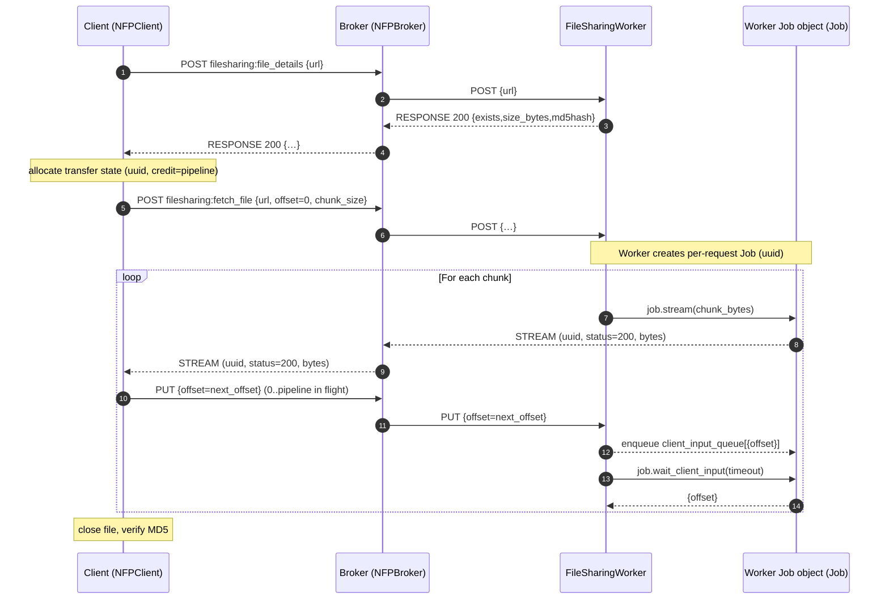

# Client file streaming (`fetch_file`) and NFP `STREAM`/`PUT`

This page documents how the Python client downloads files via the built-in **File Sharing Service** (`service="filesharing"`) using a streaming data path.

The implementation is split across:

- Client: `norfab/core/client.py`
- Broker routing: `norfab/core/broker.py`](../../norfab/core/broker.py)`
- Worker core queues/threads: `norfab/core/worker.py`
- File Sharing worker tasks: `norfab/workers/filesharing_worker/filesharing_worker.py`
- Protocol constants/builders: `norfab/core/NFP.py`

## Purpose

`NFPClient.fetch_file()` downloads `nf://...` files from a `filesharing` worker into the client’s local `fetchedfiles/` folder.

`filesharing` is a built-in NORFAB service. When you start NORFAB via `NorFab` (NFAPI) with broker enabled, NFAPI injects a default File Sharing worker (`filesharing-worker-1`) into the inventory and adds it to the topology so it is started alongside other workers.

Unlike most tasks (which return JSON via `RESPONSE`), file content is delivered as raw bytes over `NFP.STREAM`. The client uses `NFP.PUT` to request subsequent chunks (offset-based), implementing a simple **sliding window** ("pipeline") to avoid uncontrolled buffering.

### Built-in service lifecycle (NFAPI)

This is implemented in `norfab/core/nfapi.py`:

- `NorFab.start()` calls `add_built_in_workers_inventory()` when `run_broker` is enabled and the inventory topology has `broker: true`.
- `add_built_in_workers_inventory()` adds `filesharing-worker-1` with `service: filesharing` and `base_dir: <inventory.base_dir>`.
- The worker name is inserted into `inventory.topology["workers"]` (at the beginning), so it gets started like any other worker.

## High-level flow

1. Client validates the URL (`nf://...`) and prepares a destination path under `${base_dir}/fetchedfiles/`.
2. Client calls `filesharing.file_details` (normal job/response) to discover:
   - `exists`, `size_bytes`, `md5hash`
   - and to pick a worker that has the file
3. Client starts a `filesharing.fetch_file` job on the chosen worker with `offset=0` and `chunk_size=256000` (by default but can be adjusted using the `chunk_size` argument).
4. Worker reads the file and pushes each chunk using `job.stream(chunk)` (NFP `STREAM`).
5. Client receiver thread writes each chunk to disk, updates running MD5, and sends `PUT` messages to request the next offsets until complete.
6. When total received bytes match `size_bytes`, client closes the file and verifies the MD5.

### Flow diagram



## Threading model (what runs where)

### Client-side threads

The client uses a dedicated receiver thread and a dispatcher thread.

- **Receiver thread**: `recv(client)`
  - The *only* reader of the ZeroMQ socket.
  - Parses incoming multipart frames.
  - For `NFP.STREAM`: calls `handle_stream()` and (importantly) sends `NFP.PUT` requests for further chunks.
  - For `NFP.RESPONSE`/`NFP.EVENT`: updates the client-side SQLite job DB and enqueues messages for synchronous consumers.

- **Dispatcher thread**: `dispatcher(client)`
  - Finds jobs in the local job DB and sends `POST` / `GET` to the broker.
  - `fetch_file()` uses this job pipeline for:
    - `filesharing.file_details` (a standard JSON response)
    - `filesharing.fetch_file` (which primarily streams data)

### Worker-side threads

Each worker runs a small set of queue-driven threads.

- `recv(worker, destroy_event)`: reads from broker socket and fan-outs by command into queues
- `_post(...)`: handles `NFP.POST` (creates job record + ACK)
- `_get(...)`: handles `NFP.GET` (status/result polling)
- `_event(...)`: emits `NFP.EVENT`
- `_put(...)`: handles `NFP.PUT` and forwards decoded JSON into `running_jobs[uuid].client_input_queue`

The File Sharing worker task `fetch_file(job, ...)` then consumes those inputs using:

- `job.wait_client_input(timeout=chunk_timeout)`

This is how the worker learns which offsets to send next.

## Messaging formats

This section describes the multipart frame layout as it appears to each endpoint.

### Client ↔ Broker (DEALER ↔ ROUTER)

The client is a `zmq.DEALER`. The broker is a `zmq.ROUTER`.

From the client’s perspective (what `recv(client)` expects):

- Incoming from broker:

```text
[ empty, header, command, service, uuid, status, payload ]
```

Where:
- `header` is `NFP.BROKER`
- `command` is typically `NFP.RESPONSE`, `NFP.EVENT`, or `NFP.STREAM`
- `payload` is:
  - JSON bytes for `RESPONSE`/`EVENT`
  - raw file bytes for `STREAM`

From the broker’s perspective, messages include an initial identity frame that the client does not see.

### Worker ↔ Broker (DEALER ↔ ROUTER)

Workers are also `zmq.DEALER`. The broker is `zmq.ROUTER`.

Broker → worker (built by `NFP.MessageBuilder.broker_to_worker_put`):

```text
[ worker_id, empty, NFP.BROKER, NFP.PUT, sender_id, empty, uuid, request_json ]
```

Worker-side `recv(worker, ...)` strips the initial `empty`, reads `header` + `command`, then pushes the remaining frames into `put_queue`.

In `_put(...)`, the queued `work` list is treated as:

- `work[2]` = `uuid`
- `work[3]` = JSON payload

### `STREAM` payload

A stream chunk originates from the worker job via `Job.stream(data)`:

```python
msg = [
  client_address, b"", juuid, b"200", data_bytes
]
worker.send_to_broker(NFP.STREAM, msg)
```

The broker forwards `STREAM` to the client without wrapping the chunk into JSON.

## How `PUT` is used (client → worker)

In file download, `PUT` does not upload file content.

Instead, `PUT` is used as a *client-to-worker control channel* tied to the same job UUID.

- Client sends `PUT` with JSON: `{ "offset": <int> }`
- Broker routes it to the same worker that is executing the job
- Worker `_put` thread places that dict into the running job’s `client_input_queue`
- FileSharingWorker’s `fetch_file` task reads it with `job.wait_client_input()` and updates `offset`

This design provides a simple backpressure mechanism: the worker only sends the next chunk after the client requests it.

## Sliding window / pipeline (backpressure)

Client-side `pipeline` is implemented as a credit counter in `client.file_transfers[uuid]`:

- Start: `credit = pipeline`
- Each received chunk: `credit += 1`
- Each `PUT` request sent: `credit -= 1`

After writing a chunk, the client sends up to `credit` additional `PUT` requests (while there are offsets remaining), which keeps up to ~`pipeline` requests "in flight".

This keeps throughput reasonable without letting either side buffer an unbounded amount of data.

## Completion and integrity checking

Completion is detected purely by byte count:

- Client tracks `total_bytes_received` and compares to `size_bytes`.
- When equal:
  - Close the destination file
  - Verify MD5 hash against `file_details.md5hash`

If MD5 mismatches, the client marks the job as failed and logs an error.

## Operational notes / gotchas

- **Timeouts**
  - Worker `filesharing.fetch_file` defaults `chunk_timeout=5` seconds.
  - If the client stops sending `PUT` requests, the worker raises `RuntimeError`.
  - Client `fetch_file(timeout=...)` limits the overall `run_job()` operations (details + streaming job).

- **Local storage path**
  - Downloads go to `${base_dir}/fetchedfiles/<nf-path>`.

- **Binary vs text**
  - `fetch_file(read=True)` opens the downloaded file as UTF-8 text (`open(..., "r", encoding="utf-8")`).
  - For binary files, prefer `read=False` and open the returned path in binary mode.

- **Single worker selection**
  - `file_details` is called on `workers="all"`, but `fetch_file` streams from the *first* worker that reports `exists`.

## Debugging tips

- Enable debug logging for `norfab.core.client`, `norfab.core.broker`, and `norfab.core.worker`.
- Look for:
  - Client: `received stream for unknown file transfer` (mismatched/expired UUID)
  - Worker: `chunk timeout reached before received next chunk request`
  - Client: `MD5 hash mismatch`
