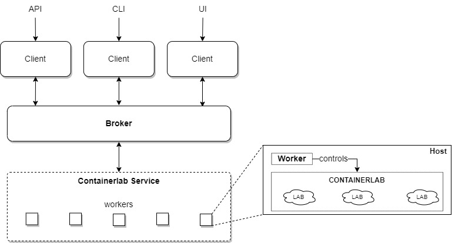

---
tags:
  - containerlab
---

# Containerlab Service

Containerlab Service is based on [Containerlab](https://containerlab.dev/) - an open-source tool for deploying and managing container-based network topologies. It provides a robust framework for automating network lab environments, enabling users to create, manage, and test network configurations efficiently.



Each NorFab Containerlab worker can manage multiple labs, offering scalability for complex network testing environments. 

By leveraging Containerlab, you can:

- Deploy network topologies using YAML-based configuration files.
- Source and deploy lab topologies from Netbox using Netbox Services.
- Inspect and monitor the status of running container labs.
- Save and restore lab configurations.
- Integrate with Nornir Service for automations testing.

## Supported Containerlab Versions

- **0.67** - tested and supported by NorfAB before 0.11.0
- **0.69** - tested and supported by NorfAB 0.11.0 onwards

## Containerlab Service Tasks

Containerlab Service supports the following tasks:

| Task          | Description  | Use Cases |
|---------------|--------------|-----------|
| **[deploy](services_containerlab_service_tasks_deploy.md)**    | Deploys a containerlab topology. | Automating lab deployments, testing network configurations. |
| **[deploy_netbox](services_containerlab_service_tasks_deploy_netbox.md)**    | Deploys a containerlab topology using Netbox devices data. | Automating lab deployments based on Netbox. |
| **[destroy_lab](services_containerlab_service_tasks_destroy.md)** | Destroys a specified lab. | Cleaning up resources, resetting lab environments. |
| **[inspect](services_containerlab_service_tasks_inspect.md)**   | Inspects the container lab containers configuration and status. | Monitoring lab status, troubleshooting. |
| **[save](services_containerlab_service_tasks_save.md)**      | Saves the configuration of a specified lab. | Backing up lab configurations. |
| **[restart_lab](services_containerlab_service_tasks_restart.md)** | Restarts a specified lab. | Reinitializing lab environments. |
| **[get_nornir_inventory](services_containerlab_service_tasks_nornir_inventory.md)** | Retrieves the Nornir inventory for a specified lab. | Generating inventory for network automation tools. |

## Containerlab Service Tasks Demo

!!! Demos

    === "Deploy"

        

    === "Deploy Netbox"

        

    === "Destroy"

        

    === "Inspect"

        

    === "Save"

        

    === "Restart"

         

    === "Nornir Inventory"

         

## Containerlab Service Show Commands

Containerlab service shell comes with a set of show commands to query service details:

```
nf#man tree show.containerlab
root
└── show:    NorFab show commands
    └── containerlab:    Show Containerlab service
        ├── inventory:    show containerlab inventory data
        ├── version:    show containerlab service version report
        ├── status:    show containerlab status
        ├── containers:    show containerlab containers
        │   ├── timeout:    Job timeout
        │   ├── workers:    Filter worker to target, default 'all'
        │   ├── verbose-result:    Control output details, default 'False'
        │   ├── details:    Show container labs details
        │   └── lab-name:    Show container for given lab only
        └── labs:    show containerlab running labs
            ├── timeout:    Job timeout
            ├── workers:    Filter worker to target, default 'all'
            └── verbose-result:    Control output details, default 'False'
nf#
```

## Nornir Service Integration

NorFab Containerlab Service integrates seamlessly with the Nornir Service to enable network automation workflows. By using the `get_nornir_inventory` task, Containerlab Service can generate a Nornir-compatible inventory for a specified lab. This inventory can then be loaded into the Nornir Service, allowing it to manage the containerlab hosts as part of its runtime inventory. Refer to [Nornir and Containerlab Services Integration](../nornir/services_nornir_service_tasks_runtime_inventory.md/#nornir-and-containerlab-services-integration)

## Netbox Service Integration

NorFab Containerlab Service integrates with Netbox to automate the deployment of network topologies using real device and link data. By leveraging the `deploy_netbox` task, users can:

- Fetch device and connection information directly from Netbox, using device lists, tenants, or advanced filters.
- Automatically generate Containerlab topology files based on Netbox inventory.
- Deploy, reconfigure, or update labs using up-to-date data from Netbox.
- Customize node parameters via Netbox device configuration context (e.g., image, kind, interface renaming).
- Seamlessly synchronize lab environments with the source of truth in Netbox.

For more details and usage examples, see the [deploy_netbox task documentation](services_containerlab_service_tasks_deploy_netbox.md).

## Use Cases

The Containerlab Service is ideal for the following scenarios:

1. **Network Topology Testing**:

    - Deploy and test complex network topologies in a controlled environment.
    - Validate network configurations and routing protocols before deploying to production.

2. **Network Automation Development**:

    - Use the `get_nornir_inventory` task to generate inventories for Nornir Service.
    - Develop and test automation scripts against realistic network topologies.

3. **Training and Education**:

    - Create hands-on labs for network training programs.
    - Simulate real-world network scenarios for educational purposes.

4. **Troubleshooting and Debugging**:

    - Recreate production network issues in a lab environment for debugging.
    - Use the `inspect` task to monitor and analyze the state of network devices.

5. **Configuration Management**:

    - Save and restore network configurations using the `save` task.
    - Reconfigure existing labs with updated topology files.

6. **Continuous Integration/Continuous Deployment (CI/CD)**:

    - Integrate with CI/CD pipelines to validate network changes automatically.
    - Use the `deploy` and `destroy_lab` tasks to spin up and tear down test environments dynamically.

:heart: **Happy CLABing !!** :heart: