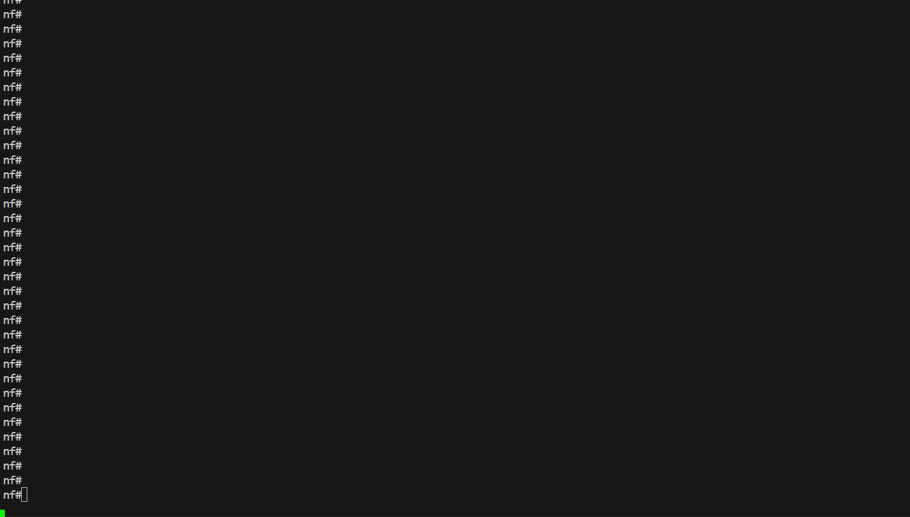

---
tags:
  - containerlab
---

# Containerlab Service Deploy Task

> task api name: `deploy`

The Containerlab service `deploy` task is designed to deploy network topologies using Containerlab. This task automates the deployment process by downloading the topology file, organizing it into a specific folder structure, and executing the `containerlab deploy` command with the appropriate arguments.

## Containerlab Deploy Task Overview

The `deploy` task provides the following features:

- **Topology Deployment**: Deploys a specified topology file to create a network lab.
- **Reconfiguration**: Supports reconfiguring an already deployed lab.
- **Node Filtering**: Allows deploying specific nodes using a filter.
- **Timeouts**: Configurable timeout for the deployment process.

## Containerlab Deploy Task Sample Usage

Containerlab topology file content used in examples:

``` yaml title="three-routers-lab.yaml" 
name: three-routers-lab

topology:
  nodes:
    r1: 
      kind: ceos
      image: ceosimage:4.30.0F
      mgmt-ipv4: 172.100.101.12
      ports:
        - 12202:22
        - 18802:80
        - 18302:830
        - 14402:443
    r2: 
      kind: ceos
      image: ceosimage:4.30.0F
      mgmt-ipv4: 172.100.101.13
      ports:
        - 12203:22
        - 18803:80
        - 18303:830
        - 14403:443
    r3: 
      kind: ceos
      image: ceosimage:4.30.0F
      mgmt-ipv4: 172.100.101.14
      ports:
        - 12204:22
        - 18804:80
        - 18304:830
        - 14404:443
        
  links:
    - endpoints: ["r1:eth1", "r2:eth1"]
    - endpoints: ["r2:eth2", "r3:eth2"]
    - endpoints: ["r3:eth3", "r1:eth3"]
    
mgmt:
  network: three_routers_lab    
  ipv4-subnet: 172.100.101.0/24  
```


Below is an example of how to use the Containerlab deploy task to deploy a topology.

!!! example

    === "Demo"

        

    === "CLI"

        ```
        nf# containerlab
        nf[containerlab]#deploy topology nf://containerlab/three-routers-topology.yaml
        --------------------------------------------- Job Events -----------------------------------------------
        05-May-2025 19:58:13.728 9e32d588fc27446db61200937974bb14 job started
        05-May-2025 19:58:13.753 INFO containerlab-worker-1 running containerlab.deploy  - Deploying lab three-routers-topology.yaml
        05-May-2025 19:58:13.770 INFO containerlab-worker-1 running containerlab.deploy  - 19:58:13 INFO Containerlab started version=0.67.0
        05-May-2025 19:58:13.782 INFO containerlab-worker-1 running containerlab.deploy  - 19:58:13 INFO Parsing & checking topology file=three-routers-topology.yaml
        05-May-2025 19:58:13.793 INFO containerlab-worker-1 running containerlab.deploy  - 19:58:13 INFO Creating docker network name=three_routers_lab IPv4 subnet=172.100.101.0/24 IPv6 subnet="" MTU=0
        05-May-2025 19:58:13.927 INFO containerlab-worker-1 running containerlab.deploy  - 19:58:13 INFO Creating container name=r3
        05-May-2025 19:58:13.939 INFO containerlab-worker-1 running containerlab.deploy  - 19:58:13 INFO Creating container name=r1
        05-May-2025 19:58:13.950 INFO containerlab-worker-1 running containerlab.deploy  - 19:58:13 INFO config file 
        05-May-2025 19:58:13.961 INFO containerlab-worker-1 running containerlab.deploy  - 19:58:13 INFO Creating container name=r2
        05-May-2025 19:58:14.678 INFO containerlab-worker-1 running containerlab.deploy  - 19:58:14 INFO Running postdeploy actions for Arista cEOS 'r3' node
        05-May-2025 19:58:14.886 INFO containerlab-worker-1 running containerlab.deploy  - 19:58:14 INFO Created link: r2:eth2 ▪┄┄▪ r3:eth2
        05-May-2025 19:58:14.897 INFO containerlab-worker-1 running containerlab.deploy  - 19:58:14 INFO Running postdeploy actions for Arista cEOS 'r2' node
        05-May-2025 19:58:14.908 INFO containerlab-worker-1 running containerlab.deploy  - 19:58:14 INFO Created link: r1:eth1 ▪┄┄▪ r2:eth1
        05-May-2025 19:58:14.937 INFO containerlab-worker-1 running containerlab.deploy  - 19:58:14 INFO Created link: r3:eth3 ▪┄┄▪ r1:eth3
        05-May-2025 19:58:14.948 INFO containerlab-worker-1 running containerlab.deploy  - 19:58:14 INFO Running postdeploy actions for Arista cEOS 'r1' node
        05-May-2025 19:58:41.856 INFO containerlab-worker-1 running containerlab.deploy  - 19:58:41 INFO Adding host entries path=/etc/hosts
        05-May-2025 19:58:42.091 9e32d588fc27446db61200937974bb14 job completed in 28.363 seconds

        --------------------------------------------- Job Results --------------------------------------------

        containerlab-worker-1:
            ----------
            containerlab-worker-1:
                ----------
                containers:
                    |_
                      ----------
                      lab_name:
                          three-routers-lab
                      labPath:
                          three-routers-topology.yaml
                      name:
                          clab-three-routers-lab-r1
                      container_id:
                          86205a93994c
                      image:
                          ceosimage:4.30.0F
                      kind:
                          ceos
                      state:
                          running
                      ipv4_address:
                          172.100.101.12/24
                      ipv6_address:
                          N/A
                      owner:
                          norfabuser
                    |_
                      ----------
                      lab_name:
                          three-routers-lab
                      labPath:
                          three-routers-topology.yaml
                      name:
                          clab-three-routers-lab-r2
                      container_id:
                          b5c74ff1f108
                      image:
                          ceosimage:4.30.0F
                      kind:
                          ceos
                      state:
                          running
                      ipv4_address:
                          172.100.101.13/24
                      ipv6_address:
                          N/A
                      owner:
                          norfabuser
                    |_
                      ----------
                      lab_name:
                          three-routers-lab
                      labPath:
                          three-routers-topology.yaml
                      name:
                          clab-three-routers-lab-r3
                      container_id:
                          1ddd29a0524d
                      image:
                          ceosimage:4.30.0F
                      kind:
                          ceos
                      state:
                          running
                      ipv4_address:
                          172.100.101.14/24
                      ipv6_address:
                          N/A
                      owner:
                          norfabuser
        nf[containerlab]# 
        ```

        In this example:

        - `nfcli` command starts the NorFab Interactive Shell
        - `containerlab` command switches to the Containerlab sub-shell
        - `deploy` command instruct Containerlab service to deploy a topology
        - `topology` specifies the path to the topology file stored on broker

    === "Python"

        This code is complete and can run as is.

        ```python
        import pprint

        from norfab.core.nfapi import NorFab

        if __name__ == '__main__':
            nf = NorFab(inventory="inventory.yaml")
            nf.start()

            client = nf.make_client()

            res = client.run_job(
                service="containerlab",
                task="deploy",
                kwargs={
                    "topology": "nf://containerlab/three-routers-topology.yaml",
                }
            )

            pprint.pprint(res)

            nf.destroy()
        ```

## Reconfiguring an Existing Lab

The `deploy` task supports reconfiguring an already deployed lab by using the `reconfigure` argument. This allows you to update the lab configuration without destroying and redeploying it.

## Filtering Nodes for Deployment

The `deploy` task allows you to deploy specific nodes in a topology using the `node_filter` argument. This is useful for testing or updating specific parts of a lab without affecting the entire topology.

## NORFAB Containerlab CLI Shell Reference

Below are the commands supported by the `deploy` task:

```
nf#man tree containerlab.deploy
root
└── containerlab:    Containerlab service
    └── deploy:    Spins up a lab using provided topology
        ├── timeout:    Job timeout
        ├── workers:    Filter worker to target, default 'all'
        ├── verbose-result:    Control output details, default 'False'
        ├── *topology:    URL to topology file to deploy
        ├── reconfigure:    Destroy the lab and then re-deploy it., default 'False'
        ├── node-filter:    Comma-separated list of node names to deploy
        └── progress:    Display progress events, default 'True'
nf#
```

``*`` - mandatory/required command argument

## Python API Reference

::: norfab.workers.containerlab_worker.ContainerlabWorker.deploy