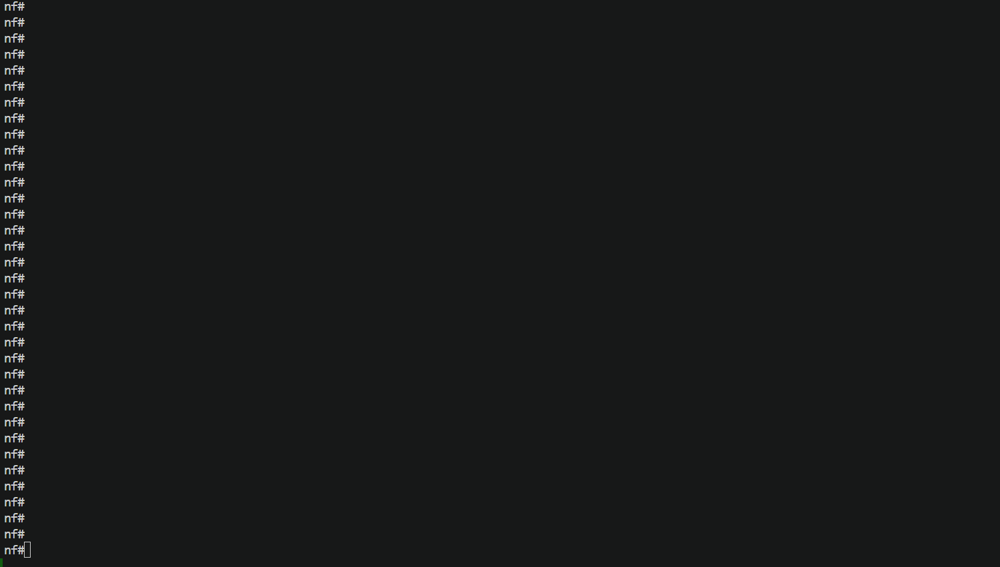

---
tags:
  - containerlab
---

# Containerlab Service Deploy Netbox Task

> task api name: `deploy_netbox`

Containerlab service `deploy_netbox` task is designed to deploy network topologies using devices data retrieved from Netbox. This task automates the deployment process by fetching nodes and links data from Netbox and constructing the topology file, organizing it into a specific folder structure, and executing the `containerlab deploy` command with the appropriate arguments.

## Containerlab Deploy Netbox Task Overview

The `deploy_netbox` task provides the following features:

- **Automated Topology Deployment**: Deploys a topology sourcing nodes and links data from Netbox using either or all of these:

    - **Netbox Devices List** - use provided device names to construct topology and deploy lab
    - **Netbox Tenant** - source devices for given tenant and deploy the lab
    - **Netbox Device Filters** - fetch devices data from Netbox GraphQL API and deploy the lab

- **Topology Links Sourcing** - links formed using Netbox devices' connections and circuits data.
- **Reconfiguration**: Supports reconfiguring an already deployed lab.
- **Node Filtering**: Allows deploying specific nodes using a filter.


## How It Works

`deploy_netbox` task uses Netbox service [get_containerlab_inventory](../netbox/services_netbox_service_tasks_get_containerlab_inventory.md) task to fetch topology inventory data from Netbox.


1. Client submits request to Containerlab service to deploy a lab

2. Containerlab worker sends job request to Netbox service to retrieve topology data for requested devices

3. Netbox service fetches data from the Netbox and constructs Containerlab inventory

4. Netbox returns lab inventor data back to Containerlab worker

5. Containerlab worker deploys lab using topology data provided by Netbox service

## Device Config Context Containerlab Parameters

Containerlab node details can be defined under device configuration context `norfab.containerlab` path, for example:

```
{
    "norfab": {
        "containerlab": {
            "kind": "ceos",
            "image": "ceos:latest",
            "mgmt-ipv4": "172.100.100.10/24",
            "ports": [
                {10000: 22},
                {10001: 830}
            ],

            ... any other containerlab node parameters ...

            "interfaces_rename": [
                {
                    "find": "Ethernet",
                    "replace": "eth",
                    "use_regex": false
                }
            ]
        }
    }
}
```

- `interfaces_rename`  - is a list of one or more interface renaming instructions, each item must have `find` and `replace` defined, optional `use_regex` flag specifies whether to use regex based pattern substitution.
- `kind` - uses Netbox device `platform` field value by default
- `image` - uses `image` value if provided, otherwise uses `{kind}:latest`

## Containerlab Deploy Netbox Task Sample Usage

Below is an example of how to use the Containerlab deploy Netbox task to deploy a topology.

!!! examples

    === "Demo - Devices List"

        

    === "CLI"

        ```
        nf#containerlab deploy-netbox lab-name foobar devices fceos4 fceos5
        --------------------------------------------- Job Events -----------------------------------------------
        31-May-2025 13:02:29.525 9e3b29210e1140f8b3a311e8c4669ca4 job started
        31-May-2025 13:02:29.533 INFO containerlab-worker-1 running containerlab.deploy_netbox  - Checking existing containers
        31-May-2025 13:02:29.573 INFO containerlab-worker-1 running containerlab.deploy_netbox  - Existing containers found, retrieving details
        31-May-2025 13:02:29.574 INFO containerlab-worker-1 running containerlab.deploy_netbox  - 172.100.100.0/24 already in use, allocating new subnet
        31-May-2025 13:02:29.575 INFO containerlab-worker-1 running containerlab.deploy_netbox  - Collected TCP/UDP ports used by existing containers
        31-May-2025 13:02:29.576 INFO containerlab-worker-1 running containerlab.deploy_netbox  - foobar allocated new subnet 172.100.102.0/24
        31-May-2025 13:02:29.576 INFO containerlab-worker-1 running containerlab.deploy_netbox  - foobar fetching lab topology data from Netbox
        31-May-2025 13:02:31.090 INFO containerlab-worker-1 running containerlab.deploy_netbox  - foobar topology data retrieved from Netbox
        31-May-2025 13:02:31.094 INFO containerlab-worker-1 running containerlab.deploy_netbox  - foobar topology data saved to 
        '/home/norfab/norfab/tests/nf_containerlab/__norfab__/files/worker/containerlab-worker-1/topologies/foobar/foobar.yaml'
        31-May-2025 13:02:31.095 INFO containerlab-worker-1 running containerlab.deploy_netbox  - foobar deploying lab using foobar.yaml topology file
        31-May-2025 13:02:31.123 INFO containerlab-worker-1 running containerlab.deploy_netbox  - 13:02:31 INFO Containerlab started version=0.67.0
        31-May-2025 13:02:31.134 INFO containerlab-worker-1 running containerlab.deploy_netbox  - 13:02:31 INFO Parsing & checking topology file=foobar.yaml
        31-May-2025 13:02:31.145 INFO containerlab-worker-1 running containerlab.deploy_netbox  - 13:02:31 INFO Creating docker network name=br-foobar IPv4 subnet=172.100.102.0/24 IPv6 subnet="" MTU=0
        31-May-2025 13:02:31.257 INFO containerlab-worker-1 running containerlab.deploy_netbox  - 13:02:31 INFO Creating lab directory 
        path=/home/norfab/norfab/tests/nf_containerlab/__norfab__/files/worker/containerlab-worker-1/topologies/foobar/clab-foobar
        31-May-2025 13:02:31.268 INFO containerlab-worker-1 running containerlab.deploy_netbox  - 13:02:31 INFO config file 
        '/home/norfab/norfab/tests/nf_containerlab/__norfab__/files/worker/containerlab-worker-1/topologies/foobar/clab-foobar/fceos4/flash/startup-config' for node 'fceos4' already exists and will not be generated/reset
        31-May-2025 13:02:31.280 INFO containerlab-worker-1 running containerlab.deploy_netbox  - 13:02:31 INFO Creating container name=fceos4
        31-May-2025 13:02:31.291 INFO containerlab-worker-1 running containerlab.deploy_netbox  - 13:02:31 INFO config file 
        '/home/norfab/norfab/tests/nf_containerlab/__norfab__/files/worker/containerlab-worker-1/topologies/foobar/clab-foobar/fceos5/flash/startup-config' for node 'fceos5' already exists and will not be generated/reset
        31-May-2025 13:02:31.302 INFO containerlab-worker-1 running containerlab.deploy_netbox  - 13:02:31 INFO Creating container name=fceos5
        31-May-2025 13:02:32.065 INFO containerlab-worker-1 running containerlab.deploy_netbox  - 13:02:32 INFO Created link: fceos5:eth1 ▪┄┄▪ fceos4:eth1
        31-May-2025 13:02:32.220 INFO containerlab-worker-1 running containerlab.deploy_netbox  - 13:02:32 INFO Created link: fceos5:eth2 ▪┄┄▪ fceos4:eth2
        31-May-2025 13:02:32.592 INFO containerlab-worker-1 running containerlab.deploy_netbox  - 13:02:32 INFO Created link: fceos5:eth3 ▪┄┄▪ fceos4:eth3
        31-May-2025 13:02:32.744 INFO containerlab-worker-1 running containerlab.deploy_netbox  - 13:02:32 INFO Created link: fceos5:eth4 ▪┄┄▪ fceos4:eth4
        31-May-2025 13:02:32.844 INFO containerlab-worker-1 running containerlab.deploy_netbox  - 13:02:32 INFO Created link: fceos5:eth6 ▪┄┄▪ fceos4:eth6
        31-May-2025 13:02:32.953 INFO containerlab-worker-1 running containerlab.deploy_netbox  - 13:02:32 INFO Created link: fceos5:eth7 ▪┄┄▪ fceos4:eth7
        31-May-2025 13:02:32.964 INFO containerlab-worker-1 running containerlab.deploy_netbox  - 13:02:32 INFO Running postdeploy actions for Arista cEOS 'fceos5' node
        31-May-2025 13:02:33.005 INFO containerlab-worker-1 running containerlab.deploy_netbox  - 13:02:33 INFO Created link: fceos5:eth8 ▪┄┄▪ fceos4:eth101
        31-May-2025 13:02:33.053 INFO containerlab-worker-1 running containerlab.deploy_netbox  - 13:02:33 INFO Created link: fceos5:eth11 ▪┄┄▪ fceos4:eth11
        31-May-2025 13:02:33.064 INFO containerlab-worker-1 running containerlab.deploy_netbox  - 13:02:33 INFO Running postdeploy actions for Arista cEOS 'fceos4' node
        31-May-2025 13:02:54.730 INFO containerlab-worker-1 running containerlab.deploy_netbox  - 13:02:54 INFO Adding host entries path=/etc/hosts
        31-May-2025 13:02:54.742 INFO containerlab-worker-1 running containerlab.deploy_netbox  - 13:02:54 INFO Adding SSH config for nodes path=/etc/ssh/ssh_config.d/clab-foobar.conf
        31-May-2025 13:02:54.859 9e3b29210e1140f8b3a311e8c4669ca4 job completed in 25.334 seconds

        --------------------------------------------- Job Results --------------------------------------------

        containerlab-worker-1:
            ----------
            containers:
                |_
                ----------
                lab_name:
                    foobar
                labPath:
                    foobar.yaml
                name:
                    clab-foobar-fceos4
                container_id:
                    c24aa0089eca
                image:
                    ceosimage:4.30.0F
                kind:
                    ceos
                state:
                    running
                ipv4_address:
                    172.100.102.2/24
                    N/A
                owner:
                    norfab
                |_
                lab_name:
                    foobar
                labPath:
                    foobar.yaml
                name:
                    clab-foobar-fceos5
                container_id:
                    2098290d7a79
                image:
                    ceosimage:4.30.0F
                kind:
                    ceos
                state:
                    running
                ipv4_address:
                    172.100.102.3/24
                ipv6_address:
                    N/A
                owner:
                    norfab
        nf#show containerlab labs
        containerlab-worker-1:
            - foobar
        nf#
        ```

        In this example:

        - `nfcli` command starts the NorFab Interactive Shell
        - `containerlab` command switches to the Containerlab sub-shell
        - `deploy_netbox` command instruct Containerlab service to deploy a topology
        - `devices` specifies list of devices to fetch data and links for from netbox

    === "Python"

        This code is complete and can run as is.

        ```python
        import pprint

        from norfab.core.nfapi import NorFab

        if __name__ == '__main__':
            nf = NorFab(inventory="inventory.yaml")
            nf.start()

            client = nf.make_client()

            res = client.run_job(
                service="containerlab",
                task="deploy_netbox",
                kwargs={
                    "devices": ["fceos4", "fceos5"],
                    "lab_name": "foobar"
                }
            )

            pprint.pprint(res)

            nf.destroy()
        ```

## Reconfiguring an Existing Lab

The `deploy_netbox` task supports reconfiguring an already deployed lab by using the `reconfigure` argument. This allows you to update the lab configuration without destroying and redeploying it.

## Filtering Nodes for Deployment

The `deploy_netbox` task allows you to deploy specific nodes in a topology using the `node_filter` argument. This is useful for testing or updating specific parts of a lab without affecting the entire topology.

## NORFAB Containerlab CLI Shell Reference

Below are the commands supported by the `deploy_netbox` task:

```
nf#man tree containerlab.deploy-netbox
└── containerlab:    Containerlab service
    └── deploy-netbox:    Spins up a lab using devices data from Netbox
        ├── timeout:    Job timeout
        ├── workers:    Filter worker to target, default 'any'
        ├── verbose-result:    Control output details, default 'False'
        ├── lab-name:    Lab name to generate lab inventory for
        ├── tenant:    Tenant name to generate lab inventory for
        ├── filters:    Netbox device filters to generate lab inventory for
        │   ├── tenant:    Filter devices by tenants
        │   ├── device-name-contains:    Filter devices by name pattern
        │   ├── model:    Filter devices by models
        │   ├── platform:    Filter devices by platforms
        │   ├── region:    Filter devices by regions
        │   ├── role:    Filter devices by roles
        │   ├── site:    Filter devices by sites
        │   ├── status:    Filter devices by statuses
        │   └── tag:    Filter devices by tags
        ├── devices:    List of devices to generate lab inventory for
        ├── progress:    Display progress events, default 'True'
        ├── netbox-instance:    Name of Netbox instance to pull inventory from
        ├── ipv4-subnet:    IPv4 management subnet to use for lab, default '172.100.100.0/24'
        ├── image:    Docker image to use for all nodes
        ├── ports:    Range of TCP/UDP ports to use for nodes, default '[12000, 13000]'
        ├── reconfigure:    Destroy the lab and then re-deploy it., default 'False'
        └── dry-run:    Do not deploy, only fetch inventory from Netbox
nf#
```

``*`` - mandatory/required command argument

## Python API Reference

::: norfab.workers.containerlab_worker.ContainerlabWorker.deploy_netbox