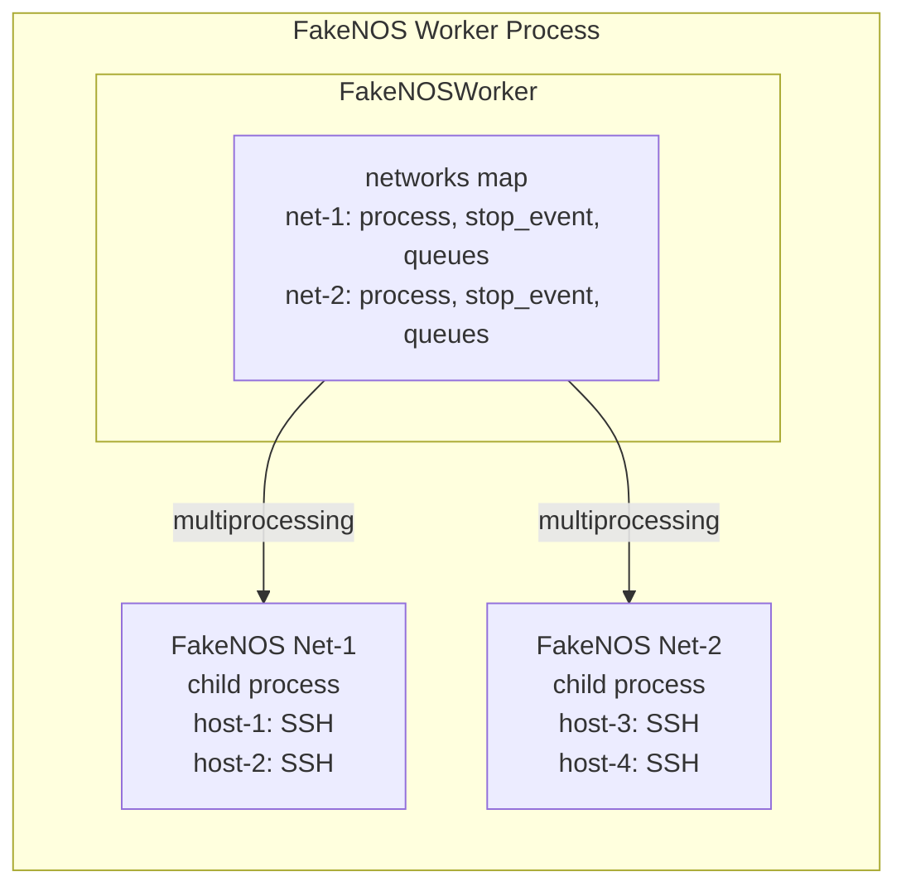

---
tags:
  - fakenos
---

# FakeNOS Service

FakeNOS Service is based on [FakeNOS](https://github.com/fakenos/fakenos) - an open-source tool for simulating network operating systems over SSH. It provides a lightweight framework for spinning up virtual network devices that respond to SSH connections, enabling development, testing, and training workflows without requiring real hardware.

Each NorFab FakeNOS worker can manage multiple independent virtual networks, with each network running in its own dedicated child process to ensure isolation and stability.

By leveraging FakeNOS, you can:

- Spin up virtual networks of SSH-accessible simulated devices on demand.
- Start, stop, and restart individual networks independently.
- Inspect the status and host details of running networks.
- Generate Nornir-compatible inventory from running FakeNOS networks for use with the Nornir Service.
- Load custom NOS (Network Operating System) plugins from the worker inventory.

## FakeNOS Service Tasks

FakeNOS Service supports the following tasks:

| Task | Description | Use Cases |
|------|-------------|-----------|
| **[start](services_fakenos_service_tasks_start.md)** | Starts a FakeNOS virtual network in a child process. | Launching simulated device environments for testing or development. |
| **[stop](services_fakenos_service_tasks_stop.md)** | Stops one or all running FakeNOS networks. | Tearing down test environments, freeing resources. |
| **[restart](services_fakenos_service_tasks_restart.md)** | Stops and restarts an existing FakeNOS network. | Reinitialising a virtual network without changing its inventory. |
| **[inspect_networks](services_fakenos_service_tasks_inspect_networks.md)** | Returns status and host details for one or all networks. | Monitoring running networks, troubleshooting connectivity. |
| **[get_nornir_inventory](services_fakenos_service_tasks_get_nornir_inventory.md)** | Builds a Nornir-compatible inventory from running FakeNOS hosts. | Feeding simulated device data into Nornir automation workflows. |
| **get_version** | Returns version information for key packages. | Verifying installed library versions. |
| **get_inventory** | Returns the raw FakeNOS inventory loaded by the worker. | Inspecting the worker's default inventory configuration. |

## FakeNOS Service Architecture



Each virtual network is isolated in its own OS process. The worker communicates with child processes using multiprocessing queues, allowing it to query host details, check liveness, and collect process metrics without blocking the main worker event loop.

## FakeNOS Service Show Commands

FakeNOS service shell comes with a set of show commands to query service details:

```
nf#man tree show.fakenos
root
└── show:    NorFab show commands
    └── fakenos:    Show FakeNOS service
        ├── networks:    Show running FakeNOS networks
        │   ├── network:    FakeNOS network name to show
        │   └── details:    Return detailed host information per network
        ├── version:    Show FakeNOS service version report
        └── inventory:    Show FakeNOS worker inventory
```
