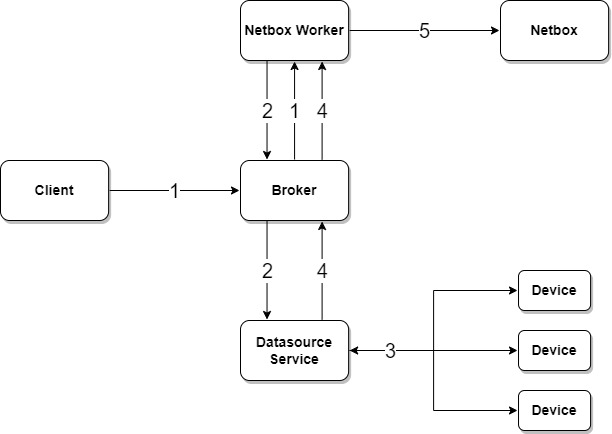

---
tags:
  - netbox
---

# Netbox Sync Device Interfaces Task

> task api name: `sync_device_interfaces`

The Netbox Sync Device Interfaces Task synchronizes device interface configuration from live network devices into NetBox using a normalized desired/current state model and DeepDiff-driven reconciliation. The task computes an explicit action plan and applies interface create, update, and delete operations in a safe dependency order.

## How It Works

The task follows a four-step pipeline:

1. **Fetch** — Pull current interface state from NetBox for the target devices.
2. **Collect live state** — Run Nornir [`parse_ttp`](../nornir/services_nornir_service_tasks_parse.md) jobs using the `interfaces` configuration getter first, followed by the `interfaces_status` operational getter. Configuration remains authoritative; operational state fills only MTU, duplex, and speed values that configuration parsing returned as `null`. Operational `speed_bps` is converted to the Kbit/s value expected by NetBox.
3. **Diff** — Normalize both sides to a common schema, apply `interface_map` to live interface names, and compare using DeepDiff to classify each interface as `create`, `update`, `delete`, or `in_sync`.
4. **Reconcile** — Apply changes to NetBox in dependency order to avoid constraint errors:
    1. Create LAG interfaces first
    2. Create parent (non-child) interfaces
    3. Create child (sub)interfaces referencing their parents
    4. Bulk update changed interfaces
    5. Delete interfaces present in NetBox but absent in live data (only when `process_deletions=True`)



1. Client submits an on-demand request to the NorFab Netbox worker to sync device interfaces
2. Netbox worker sends a job request to the Nornir service to fetch live interface data from devices
3. Nornir service collects interface data from the network using `parse_ttp`
4. Nornir returns normalized interface data to the Netbox worker
5. Netbox worker applies planned actions and returns per-device action summaries and field-level diffs

## Interface Type Behavior

New interfaces retain the type inferred from live data. Creation accepts any
NetBox interface type, including `other`, which remains the catch-all when the
parser cannot identify a more specific physical type.

For existing interfaces, `update_type=True` is the default and enables safe
logical type correction:

- `other` can change to `virtual`, `bridge`, or `lag`.
- `virtual`, `bridge`, and `lag` can change between one another.
- A specific physical type is never replaced with another type.
- No existing type is replaced with `other`.

Loopback interfaces use NetBox type `virtual`; `loopback` is not submitted as
an interface type. Set `update_type=False` to disable all type changes for
existing interfaces. Unsafe transitions are omitted from the actionable diff
and reported as warning events.

## Output

**Dry-run mode** (`dry_run=True`) returns the diff plan without making any changes, keyed by device name:

```json
{
    "<device>": {
        "create": ["Loopback99", "Port-Channel41"],
        "update": {
            "Ethernet1": {
                "description": {"old_value": "old desc", "new_value": "new desc"}
            }
        },
        "delete": ["StaleInterface"],
        "in_sync": ["Loopback0", "Ethernet2"]
    }
}
```

**With Approval** — Pass `with_approval=True` to use interactive NFCLI workflow. Sync task displays its preview, and waits for approval before applying changes. Declining at that point will return dry-run result.

!!! note
    
    When both `dry-run` and `with_approval` are `True`, `dry-run` logic ignored.

**Live-run mode** (`dry_run=False`, default) applies changes and returns a summary of actions taken:

```json
{
    "<device>": {
        "created": ["Loopback99", "Port-Channel41"],
        "updated": ["Ethernet1"],
        "deleted": ["StaleInterface"],
        "in_sync": ["Loopback0", "Ethernet2"]
    }
}
```

In live-run mode `res["diff"]` is also populated with field-level change details for all interfaces that were created or updated.

## Filtering

Interfaces can be scoped using glob patterns so that only a subset is considered on both the live and NetBox sides:

- `filter_by_name` — match interface names, e.g. `"Loopback*"` or `"Ethernet[1-4]"`
- `filter_by_description` — match interface descriptions, e.g. `"uplink*"` or `"TEST_SYNC_*"`

Both filters are applied before the diff, so interfaces that do not match are completely ignored by the sync — they are neither created, updated, nor deleted.

## Interface Name Mapping

`interface_map` accepts an ordered list of rename rules inline or as an
`nf://` URL to a YAML file:

```yaml
- device_name: leaf-*
  device_type: cEOS-*-CA
  match: Ethernet
  replace: Et
```

`device_name` and `device_type` are case-sensitive glob patterns. Device type
matches the NetBox device type model. `match` is a case-sensitive literal
substring in the live interface name and `replace` is its replacement, so the
example renames `Ethernet12` to `Et12`. All three match criteria must succeed.
Rules are evaluated in list order and the first match wins. Interfaces that do
not match a rule keep their live names.

Mapping is also applied to live parent and LAG interface references before
name filtering and DeepDiff comparison.

```yaml
interface_map: nf://netbox/interface_map.yaml
```

## Deletion Behavior

By default `process_deletions=False` — interfaces present in NetBox but absent in live data are left untouched. Set `process_deletions=True` to enable deletion. Child interfaces are always deleted before their parents to avoid foreign-key constraint errors.

## Ignoring VLANs and VRFs

By default, discovered VLANs and VRFs are resolved or created in NetBox and associated with interfaces. Set `ignore_vlans=True` to skip VLAN creation and leave all interface VLAN associations unchanged. Set `ignore_vrf=True` to skip VRF creation and leave interface VRF associations unchanged.

## VLAN Group Selection

`vlan_group` accepts one exact VLAN group name and acts as the fallback for
VLANs not matched by `vlan_map`. Slugs and numeric IDs are not resolved. When
neither argument selects a group, the device site is used.

`vlan_map` accepts the same ordered list of rules as VLAN sync, inline or as an
`nf://` URL to a YAML file:

```python
[
    {
        "vlan_group": "ACCESS_VLANS",
        "interface_names": ["Ethernet*"],
        "vlan_ids": ["100-199", "300"],
        "device_names": ["leaf-*"],
    },
    {
        "vlan_group": "INFRA_VLANS",
        "vlan_ids": ["400-499"],
    },
]
```

Values within one criterion use OR logic and populated criteria use AND logic.
Rules are checked in list order and the first match wins. Interface and device
names use case-sensitive glob matching. VLAN ranges use plain strings such as
`100-199`; bracket notation is not accepted. Interface sync ignores
`vlan_names` because interface parsing does not provide VLAN names. Each rule
also uses the referenced NetBox group's `vid_ranges`; explicit `vlan_ids`
narrow those group ranges. A rule containing only `vlan_group` is valid.

## Branching Support

The task is branch-aware and can push changes into a NetBox branch. The [Netbox Branching Plugin](https://github.com/netboxlabs/netbox-branching) must be installed. Specify the `branch` parameter; the branch is created automatically if it does not already exist.

## Examples

=== "CLI"

    Sync interfaces for a list of devices:

    ```
    nf#netbox sync interfaces devices ceos-spine-1 ceos-spine-2
    ```

    Select VLAN groups with ordered rules and a fallback group:

    ```
    nf#netbox sync interfaces devices leaf-1 vlan-group DEFAULT_VLANS vlan-map '[{"vlan_group":"ACCESS_VLANS","vlan_ids":["100-199"],"interface_names":["Ethernet*"]}]'
    ```

    Preview changes without writing to NetBox (dry run):

    ```
    nf#netbox sync interfaces devices ceos-spine-1 dry-run
    ```

    Sync and delete interfaces absent from live data:

    ```
    nf#netbox sync interfaces devices ceos-spine-1 ceos-spine-2 process-deletions
    ```

    Restrict sync to loopback interfaces only:

    ```
    nf#netbox sync interfaces devices ceos-spine-1 filter-by-name "Loopback*"
    ```

    Map a live interface name to the preferred NetBox name:

    ```bash
    nf#netbox sync interfaces devices leaf-1 interface-map '[{"device_name":"leaf-*","device_type":"cEOS-*-CA","match":"Ethernet","replace":"Et"}]'
    ```

    Download interface and VLAN mapping rules from YAML files:

    ```bash
    nf#netbox sync interfaces devices leaf-1 interface-map nf://netbox/interface_map.yaml vlan-map nf://netbox/vlan_map.yaml
    ```

    Restrict sync to interfaces whose description matches a glob pattern:

    ```
    nf#netbox sync interfaces devices ceos-spine-1 filter-by-description "TEST_SYNC_*"
    ```

    Sync interfaces without creating or associating VLANs and VRFs:

    ```
    nf#netbox sync interfaces devices ceos-spine-1 ignore-vlans ignore-vrf
    ```

    Sync interfaces into a NetBox branch:

    ```
    nf#netbox sync interfaces devices ceos-spine-1 ceos-spine-2 branch sprint-42-interfaces
    ```

    Sync using Nornir host filters instead of explicit device names:

    ```
    nf#netbox sync interfaces FC spine
    ```

=== "Python"

    ```python
    from norfab.core.nfapi import NorFab

    nf = NorFab(inventory="./inventory.yaml")
    nf.start()
    client = nf.make_client()

    # sync interfaces for specific devices
    result = client.run_job(
        "netbox",
        "sync_device_interfaces",
        workers="any",
        kwargs={
            "devices": ["ceos-spine-1", "ceos-spine-2"],
        },
    )

    # dry run — preview creates/updates/deletes without writing
    result = client.run_job(
        "netbox",
        "sync_device_interfaces",
        workers="any",
        kwargs={
            "devices": ["ceos-spine-1", "ceos-spine-2"],
            "dry_run": True,
        },
    )

    # sync and delete interfaces absent from live data
    result = client.run_job(
        "netbox",
        "sync_device_interfaces",
        workers="any",
        kwargs={
            "devices": ["ceos-spine-1"],
            "process_deletions": True,
        },
    )

    # restrict sync to loopback interfaces only
    result = client.run_job(
        "netbox",
        "sync_device_interfaces",
        workers="any",
        kwargs={
            "devices": ["ceos-spine-1"],
            "filter_by_name": "Loopback*",
        },
    )

    # map live interface names to preferred NetBox names before comparison
    result = client.run_job(
        "netbox",
        "sync_device_interfaces",
        workers="any",
        kwargs={
            "devices": ["leaf-1"],
            "interface_map": [
                {
                    "device_name": "leaf-*",
                    "device_type": "cEOS-*-CA",
                    "match": "Ethernet",
                    "replace": "Et",
                }
            ],
        },
    )

    # restrict sync to interfaces with a specific description pattern
    result = client.run_job(
        "netbox",
        "sync_device_interfaces",
        workers="any",
        kwargs={
            "devices": ["ceos-spine-1"],
            "process_deletions": True,
            "filter_by_description": "TEST_SYNC_*",
        },
    )

    # sync interfaces without creating or associating VLANs and VRFs
    result = client.run_job(
        "netbox",
        "sync_device_interfaces",
        workers="any",
        kwargs={
            "devices": ["ceos-spine-1"],
            "ignore_vlans": True,
            "ignore_vrf": True,
        },
    )

    # dynamically select VLAN groups, with DEFAULT_VLANS as the fallback
    result = client.run_job(
        "netbox",
        "sync_device_interfaces",
        workers="any",
        kwargs={
            "devices": ["ceos-spine-1"],
            "vlan_group": "DEFAULT_VLANS",
            "vlan_map": [
                {
                    "vlan_group": "ACCESS_VLANS",
                    "interface_names": ["Ethernet*"],
                    "vlan_ids": ["100-199", "300"],
                },
                {
                    "vlan_group": "INFRA_VLANS",
                    "vlan_ids": ["400-499"],
                },
            ],
        },
    )

    # sync into a NetBox branch
    result = client.run_job(
        "netbox",
        "sync_device_interfaces",
        workers="any",
        kwargs={
            "devices": ["ceos-spine-1", "ceos-spine-2"],
            "branch": "sprint-42-interfaces",
        },
    )

    # use Nornir host filters instead of explicit device names
    result = client.run_job(
        "netbox",
        "sync_device_interfaces",
        workers="any",
        kwargs={
            "FC": "spine",
        },
    )

    nf.destroy()
    ```

## NORFAB Netbox Sync Device Interfaces Command Shell Reference

NorFab shell supports these command options for the `sync_device_interfaces` task:

```
nf# man tree netbox.sync.interfaces
root
└── netbox:    Netbox service
    └── sync:    Sync Netbox data
        └── interfaces:    Sync device interfaces with NetBox
            ├── timeout:    Job timeout in seconds
            ├── workers:    Filter worker to target, default 'any'
            ├── verbose-result:    Control output details, default 'False'
            ├── progress:    Display progress events, default 'True'
            ├── instance:    Netbox instance name to target
            ├── dry-run:    Return diff plan without pushing changes to NetBox
            ├── devices:    List of NetBox device names to sync
            ├── process-deletions:    Delete interfaces present in NetBox but absent in live data
            ├── interface-map:    Ordered rules mapping live interface names to preferred NetBox names
            ├── filter-by-name:    Glob pattern to restrict sync by interface name, e.g. 'Loopback*'
            ├── filter-by-description:    Glob pattern to restrict sync by interface description
            ├── update-type:    Safely update existing NetBox logical interface types, default 'True'
            ├── vlan-group:    Fallback VLAN group exact name
            ├── vlan-map:    Ordered VLAN-to-group mapping rules
            ├── ignore-vlans:    Ignore discovered VLANs and leave interface VLAN associations unchanged
            ├── ignore-vrf:    Ignore discovered VRFs and leave interface VRF associations unchanged
            ├── branch:    Branching plugin branch name to push changes into
            ├── FO:    Filter Nornir hosts using Filter Object
            ├── FB:    Filter Nornir hosts by name using Glob Patterns
            ├── FH:    Filter Nornir hosts by hostname
            ├── FC:    Filter Nornir hosts by name containment
            ├── FR:    Filter Nornir hosts by name using Regular Expressions
            ├── FG:    Filter Nornir hosts by group
            ├── FP:    Filter Nornir hosts by hostname using IP Prefix
            ├── FL:    Filter Nornir hosts by names list
            ├── FM:    Filter Nornir hosts by platform
            └── FN:    Negate the Nornir host filter match
nf#
```

## Python API Reference

::: norfab.workers.netbox_worker.netbox_worker.NetboxWorker.sync_device_interfaces
