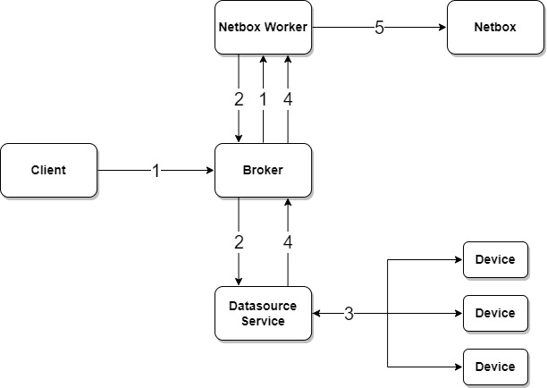

---
tags:
  - netbox
---

# Netbox Sync Device IP Task

> task api name: `sync_device_ip`

The Netbox Sync Device IP Task synchronizes IP address assignments from live network devices into NetBox using a normalized desired/current state model and bulk-reconciliation. The task computes an explicit action plan — create, update, or mark in-sync — and applies it in a single pair of bulk API calls.

## How It Works

The task follows a three-step pipeline:

1. **Collect live state** — Run a Nornir [`parse_ttp`](../nornir/services_nornir_service_tasks_parse.md) job against the target devices to collect live IPv4 and IPv6 addresses per interface.
2. **Fetch NetBox state** — Retrieve all existing IP address objects from NetBox that match any discovered address value.
3. **Reconcile** — Compare live addresses against NetBox records and classify each IP as:
    - **create** — address not in NetBox at all; a new record is created and assigned to the interface
    - **update** — address exists in NetBox but is unassigned or has a stale role/VRF; the record is updated
    - **in_sync** — address already assigned to the correct interface with the correct role and VRF; no change needed

Roles are assigned automatically:

- Interfaces whose name starts with `loopback` or `lo` → role `loopback`
- Addresses that fall within any configured `anycast_ranges` prefix → role `anycast`
- All other addresses → no role (standard unicast)



1. Client submits an on-demand request to the NorFab Netbox worker to sync device IP addresses
2. Netbox worker sends a job request to the Nornir service to fetch live interface data from devices
3. Nornir service collects IP address data from the network using `parse_ttp`
4. Nornir returns normalized interface and IP data to the Netbox worker
5. Netbox worker reconciles live addresses against NetBox and applies bulk create/update operations

## Result Structure

Both dry-run and live-run modes return the same per-device structure keyed by device name:

```json
{
    "<device>": {
        "created": ["10.0.0.1/31", "192.168.1.1/32"],
        "updated": ["10.0.0.3/31"],
        "in_sync": ["10.0.0.5/31", "2001:db8::1/128"]
    }
}
```

**Dry-run mode** (`dry_run=True`) returns what *would* be created or updated without making any changes to NetBox.

**Live-run mode** (`dry_run=False`, default) applies changes and returns the same structure showing what was done.

## Filtering

IP addresses and interfaces can be scoped before reconciliation. All filters are applied at the live-data collection phase, so excluded addresses are completely ignored — they are neither created nor updated.

- `filter_by_name` — glob pattern matched against interface names, e.g. `"Loopback*"` or `"Ethernet[1-4]"`. Interfaces not matching are skipped entirely.
- `filter_by_description` — glob pattern matched against interface descriptions, e.g. `"uplink*"`. Interfaces not matching are skipped.
- `filter_by_prefix` — CIDR prefix such as `"10.0.0.0/8"`. Only IP addresses whose host address falls within the prefix are included; supports both IPv4 and IPv6.
- `filter_by_ip` — glob pattern matched against the host portion of the IP address (without prefix length), e.g. `"10.0.1.*"`. Only matching addresses are included.

Multiple filters combine as intersection — all specified conditions must be satisfied for an IP to be included.

## Anycast Support

IP addresses in one or more `anycast_ranges` prefixes are assigned the `anycast` role. NetBox allows multiple IP address records with the same value when the role is `anycast`, so each device gets its own record. Without `anycast_ranges`, a second device trying to use the same IP address triggers a duplicate-conflict error.

Set `anycast_ranges` to a prefix string or list of prefixes:

```
anycast_ranges = "10.0.250.0/24"
anycast_ranges = ["10.0.250.0/24", "2001:db8:ffff::/48"]
```

## Process Prefixes

When `create_prefixes=True` the task also creates a NetBox prefix record for the network of each discovered IP address (e.g. `10.0.1.0/31` for `10.0.1.1/31`). Existing prefixes are never updated or deleted — this is a create-only, idempotent operation. Site and VRF are propagated from the device and interface context.

## Branching Support

The task is branch-aware and can push changes into a NetBox branch. The [Netbox Branching Plugin](https://github.com/netboxlabs/netbox-branching) must be installed. Specify the `branch` parameter; the branch is created automatically if it does not already exist.

## Duplicate IP Guard

Before executing bulk writes the task checks that no non-anycast IP address appears more than once across the combined create and update payloads. If a duplicate is detected, all copies are removed from the payload and an error is recorded in the result, preventing NetBox from receiving conflicting assignments in a single request.

## Examples

=== "CLI"

    Sync IP addresses for a list of devices:

    ```
    nf#netbox sync ip-addresses devices ceos-spine-1 ceos-spine-2
    ```

    Preview changes without writing to NetBox (dry run):

    ```
    nf#netbox sync ip-addresses devices ceos-spine-1 dry-run
    ```

    Sync only loopback interface addresses:

    ```
    nf#netbox sync ip-addresses devices ceos-spine-1 filter-by-name "Loopback*"
    ```

    Sync only addresses within a specific prefix:

    ```
    nf#netbox sync ip-addresses devices ceos-spine-1 filter-by-prefix "10.3.0.0/16"
    ```

    Classify addresses in an anycast range and sync all devices:

    ```
    nf#netbox sync ip-addresses devices ceos-spine-1 ceos-spine-2 ceos-leaf-1 anycast-ranges 10.0.250.0/24
    ```

    Also create prefix records for each discovered IP subnet:

    ```
    nf#netbox sync ip-addresses devices ceos-spine-1 create-prefixes
    ```

    Sync into a NetBox branch:

    ```
    nf#netbox sync ip-addresses devices ceos-spine-1 ceos-spine-2 branch sprint-42-ips
    ```

    Sync using Nornir host filters instead of explicit device names:

    ```
    nf#netbox sync ip-addresses FC spine
    ```

=== "Python"

    ```python
    from norfab.core.nfapi import NorFab

    nf = NorFab(inventory="./inventory.yaml")
    nf.start()
    client = nf.make_client()

    # sync IP addresses for specific devices
    result = client.run_job(
        "netbox",
        "sync_device_ip",
        workers="any",
        kwargs={
            "devices": ["ceos-spine-1", "ceos-spine-2"],
        },
    )

    # dry run — preview creates/updates without writing to NetBox
    result = client.run_job(
        "netbox",
        "sync_device_ip",
        workers="any",
        kwargs={
            "devices": ["ceos-spine-1", "ceos-spine-2"],
            "dry_run": True,
        },
    )

    # restrict sync to loopback interfaces only
    result = client.run_job(
        "netbox",
        "sync_device_ip",
        workers="any",
        kwargs={
            "devices": ["ceos-spine-1"],
            "filter_by_name": "Loopback*",
        },
    )

    # restrict sync to addresses within a specific prefix
    result = client.run_job(
        "netbox",
        "sync_device_ip",
        workers="any",
        kwargs={
            "devices": ["ceos-spine-1", "ceos-spine-2"],
            "filter_by_prefix": "10.3.0.0/16",
        },
    )

    # restrict sync to addresses matching a glob pattern
    result = client.run_job(
        "netbox",
        "sync_device_ip",
        workers="any",
        kwargs={
            "devices": ["ceos-spine-1"],
            "filter_by_ip": "10.3.4.*",
        },
    )

    # restrict sync to interfaces with a specific description pattern
    result = client.run_job(
        "netbox",
        "sync_device_ip",
        workers="any",
        kwargs={
            "devices": ["ceos-spine-1"],
            "filter_by_description": "uplink*",
        },
    )

    # classify addresses in anycast ranges and sync all fabric devices
    result = client.run_job(
        "netbox",
        "sync_device_ip",
        workers="any",
        kwargs={
            "devices": ["ceos-spine-1", "ceos-spine-2", "ceos-leaf-1", "ceos-leaf-2"],
            "anycast_ranges": "10.0.250.0/24",
        },
    )

    # multiple anycast ranges (IPv4 and IPv6)
    result = client.run_job(
        "netbox",
        "sync_device_ip",
        workers="any",
        kwargs={
            "devices": ["ceos-spine-1", "ceos-spine-2"],
            "anycast_ranges": ["10.0.250.0/24", "2001:db8:ffff::/48"],
        },
    )

    # also create prefix records for each discovered IP subnet
    result = client.run_job(
        "netbox",
        "sync_device_ip",
        workers="any",
        kwargs={
            "devices": ["ceos-spine-1"],
            "create_prefixes": True,
        },
    )

    # sync into a NetBox branch
    result = client.run_job(
        "netbox",
        "sync_device_ip",
        workers="any",
        kwargs={
            "devices": ["ceos-spine-1", "ceos-spine-2"],
            "branch": "sprint-42-ips",
        },
    )

    # use Nornir host filters instead of explicit device names
    result = client.run_job(
        "netbox",
        "sync_device_ip",
        workers="any",
        kwargs={
            "FC": "spine",
        },
    )

    # combine filters: loopback interfaces within a specific prefix, dry run
    result = client.run_job(
        "netbox",
        "sync_device_ip",
        workers="any",
        kwargs={
            "devices": ["ceos-spine-1", "ceos-spine-2"],
            "filter_by_name": "Loopback*",
            "filter_by_prefix": "10.3.4.0/24",
            "dry_run": True,
        },
    )

    nf.destroy()
    ```

## NORFAB Netbox Sync Device IP Command Shell Reference

NorFab shell supports these command options for the `sync_device_ip` task:

```
nf# man tree netbox.sync.ip-addresses
root
└── netbox:    Netbox service
    └── sync:    Sync Netbox data
        └── ip-addresses:    Sync device IP addresses with NetBox
            ├── timeout:    Job timeout in seconds
            ├── workers:    Filter worker to target, default 'any'
            ├── verbose-result:    Control output details, default 'False'
            ├── progress:    Display progress events, default 'True'
            ├── instance:    Netbox instance name to target
            ├── dry-run:    Return reconciliation plan without pushing changes to NetBox
            ├── devices:    List of NetBox device names to sync
            ├── anycast-ranges:    IP prefix(es) used to classify addresses as anycast role
            ├── create-prefixes:    Create missing IP prefix records for each discovered address
            ├── filter-by-name:    Glob pattern to restrict sync by interface name, e.g. 'Loopback*'
            ├── filter-by-description:    Glob pattern to restrict sync by interface description
            ├── filter-by-prefix:    CIDR prefix to restrict sync to addresses within it, e.g. '10.0.0.0/8'
            ├── filter-by-ip:    Glob pattern to restrict sync by IP host address, e.g. '10.0.1.*'
            ├── branch:    Branching plugin branch name to push changes into
            ├── FO:    Filter Nornir hosts using Filter Object
            ├── FB:    Filter Nornir hosts by name using Glob Patterns
            ├── FH:    Filter Nornir hosts by hostname
            ├── FC:    Filter Nornir hosts by name containment
            ├── FR:    Filter Nornir hosts by name using Regular Expressions
            ├── FG:    Filter Nornir hosts by group
            ├── FP:    Filter Nornir hosts by hostname using IP Prefix
            ├── FL:    Filter Nornir hosts by names list
            ├── FM:    Filter Nornir hosts by platform
            └── FN:    Negate the Nornir host filter match
nf#
```

## Python API Reference

::: norfab.workers.netbox_worker.netbox_worker.NetboxWorker.sync_device_ip