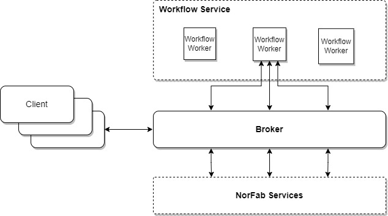

---
tags:
  - workflow
---

# Workflow Service

The Workflow Service allows users to define workflows as YAML files, where each workflow consists of multiple steps. Each step represents a task to be executed, with support for conditional execution based on the results of other steps. This makes it easy to automate complex processes while maintaining control over execution flow.
 
 

How it works:

1. Client submit request to run workflow
2. Workflow worker executes workflow steps interacting with NorFab services
3. Results of workflow execution returned to client

**Key Features**

- **YAML-Based DSL**: Simple and human-readable workflow definitions.
- **Conditional Execution**: Dynamically control step execution using conditions like `run_if_fail_all` or `run_if_pass_any` etc..
- **Error Handling**: Stop workflows on critical failures using `stop_on_failure`.
- **Integration**: Seamlessly integrates with other Norfab services like Nornir and Netbox.
- **Scalability**: Supports workflows with multiple steps and dependencies.

## Workflow Service Tasks

Workflow Service supports a number of tasks to interact with NorFab service.

| Task          | Description  | Use Cases |
|---------------|--------------|-----------|
| **[run](services_workflow_service_tasks_run.md)** | Run Workflow | Automate multi-step processes with conditional logic. |

## Workflow Language Specification

The workflow language defines a structure for creating and executing workflows in Norfab. A workflow consists of multiple steps, each representing a task to be executed. Steps can include conditions to determine whether they should run based on the results of other steps.

Notes:

1. Steps are executed in the order they are defined in the workflow file.
2. Conditional execution fields (run_if_fail_all, run_if_pass_all etc.) allow for dynamic control of step execution based on the results of previous steps.
3. The kwargs field is highly flexible and allows passing task-specific arguments to customize behavior.
4. This specification provides a clear structure for defining workflows, enabling complex automation scenarios with conditional step execution. 

### Top-Level Fields

- **`name`** (*string*, required): The name of the workflow.
- **`description`** (*string*, optional): A description of the workflow's purpose.
- **`any steps`** (*dict*, required): A dictionary of steps, where each key is the step name and the value defines the step's configuration.

### Step Configuration

Each step is defined as a dictionary with the following fields.

**Common FIelds**

- **`service`** (*string*, required): The service to be used for the step (e.g., `nornir`).
- **`task`** (*string*, required): The task to be executed by the service (e.g., `cli`, `task`).
- **`kwargs`** (*dict*, optional): A dictionary of arguments to pass to the task. These arguments are task-specific.

**Step Conditionals**

- **`run_if_fail_any`** (*list*, optional): A list of step names. The current step will only run if any of the specified steps have failed.
- **`run_if_pass_any`** (*list*, optional): A list of step names. The current step will only run if any of the specified steps have passed.
- **`run_if_fail_all`** (*list*, optional): A list of step names. The current step will only run if all the specified steps have failed.
- **`run_if_pass_all`** (*list*, optional): A list of step names. The current step will only run if all the specified steps have passed.
- **`stop_on_failure`** (*bool*, optional): If set to `True`, the execution of the entire workflow will stop if this step fails.

### Example Workflow

```yaml
name: test_workflow_run_if_fail_all
description: Sample Workflow to show what can be done

step1_failed:
  service: nornir
  task: task
  kwargs:
    FC: spine
    plugin: nornir_salt.plugins.tasks.nr_test
    excpt: True # raise exception

step2_failed:
  service: nornir
  task: task
  kwargs:
    FC: leaf
    plugin: nornir_salt.plugins.tasks.nr_test
    excpt: True # raise exception

step3_passed:
  service: nornir
  task: task
  kwargs:
    FC: spine,leaf
    plugin: nornir_salt.plugins.tasks.nr_test
    ret_data: True

step4-should-run:
  service: nornir
  task: cli
  kwargs:
    FC: leaf
    commands:
      - show hostname
      - show ntp status
  run_if_fail_all: 
    - step1_failed
    - step2_failed

step5-should-not-run:
  service: nornir
  task: cli
  kwargs:
    FC: leaf
    commands:
      - show hostname
      - show ntp status
  run_if_fail_all: 
    - step1_failed
    - step2_failed
    - step3_passed
```

### Conditional Execution

#### `run_if_fail_all`

**Description**: Specifies a list of steps. The current step will only execute if all the listed steps have failed.

**Use Case**: Ensures that the step only runs if all workers failed execution of specified steps.

**Example**:

```
run_if_fail_all:
  - step1
  - step2
```

#### `run_if_pass_all`

**Description**: Specifies a list of steps. The current step will only execute if all the listed steps have passed.

**Use Case**: Ensures that the step only runs if all workers successfully executed specified steps.

**Example**:

```
run_if_fail_all:
  - step1
  - step2
```

#### `run_if_pass_any`

**Description**: Specifies a list of steps. The current step will only execute if any of the listed steps have passed.

**Use Case**: Useful when subsequent steps should only run if any of the specified steps succeed.

**Example**:

```
run_if_pass_any:
  - step1
  - step2
```

#### `run_if_fail_any`

**Description**: Specifies a list of steps. The current step will only execute if any of the listed steps have failed.

**Use Case**: Useful when subsequent steps depend on the success of at least one worker in the specified steps.

**Example**:

```
run_if_fail_any:
  - step1
  - step2
```

#### `stop_on_failure`

**Description**: A flag that, when set to `True`, stops the execution of the entire workflow if the current step fails.

**Use Case**: Useful for workflows where failure in a critical step should halt further execution to prevent cascading errors or unnecessary processing.

**Example**:

```
stop_on_failure: True
```

## Workflow Service Shell Show Commands

Workflow service shell comes with this set of show commands to query various information:

```
nf#man tree show.workflow
root
└── show:    NorFab show commands
    └── workflow:    Show Workflow service
        ├── inventory:    Show workflow workers inventory data
        │   ├── timeout:    Job timeout
        │   └── workers:    Filter worker to target, default 'all'
        └── version:    Show workflow service workers version report
            ├── timeout:    Job timeout
            └── workers:    Filter worker to target, default 'all'
nf#
```
